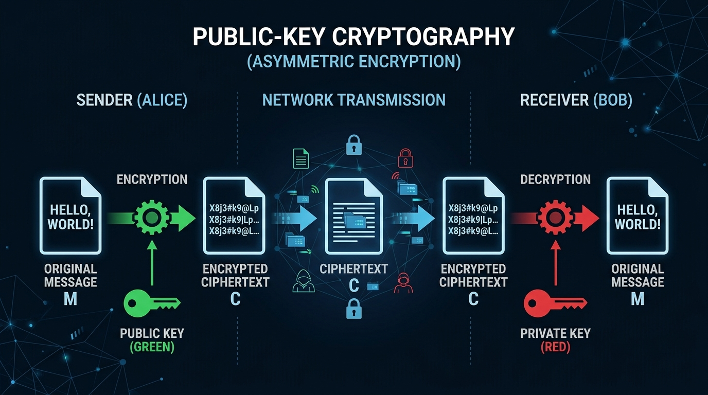
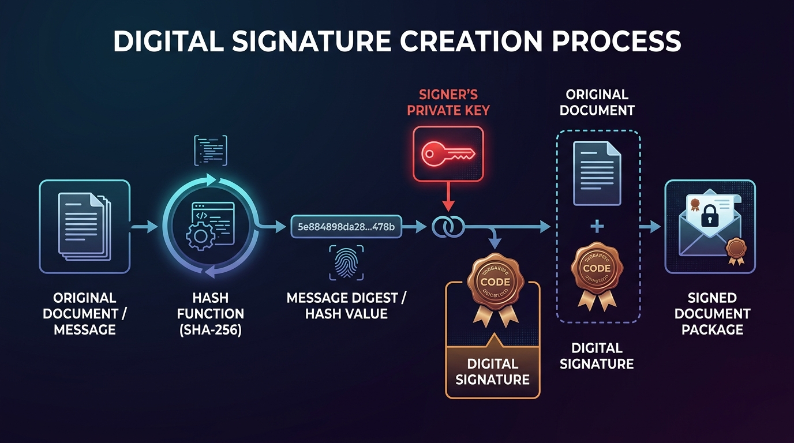
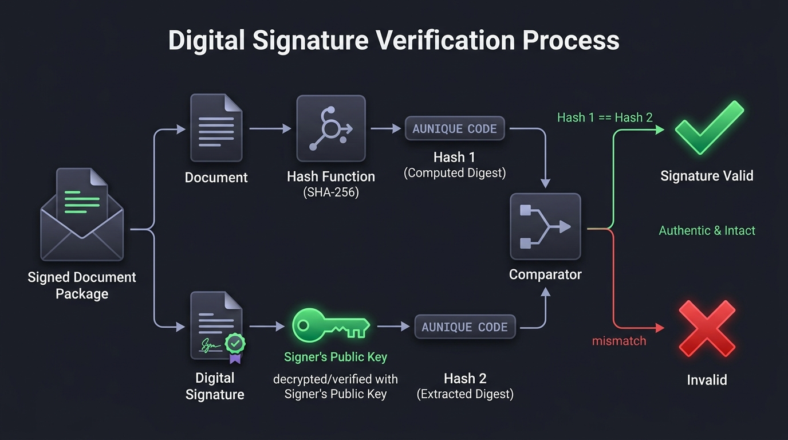
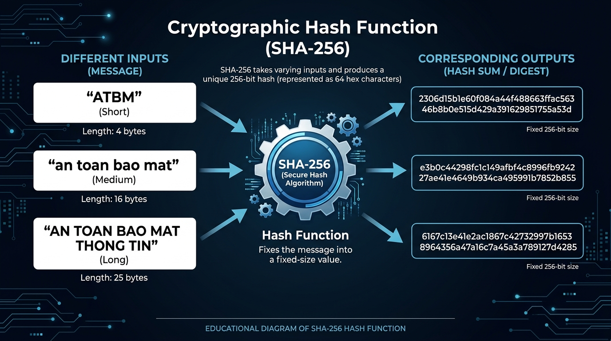

# CHƯƠNG 2: KẾT QUẢ NGHIÊN CỨU

---

## 2.1. Nghiên cứu, tìm hiểu hệ mã hóa công khai

### 2.1.1. Khái niệm chung
Năm 1976, Whitfield Diffie và Martin Hellman (D&H) đã công bố công trình nghiên cứu mang tính cách mạng mang tên *"New Directions in Cryptography"* [1], đưa ra phương pháp mã hóa có thể giải quyết triệt để những nhược điểm cố hữu của mã khoá bí mật (mã hóa đối xứng). Đó là **Mã hoá khóa công khai (PKC - Public Key Cryptography)**, hay còn gọi là **Mật mã học bất đối xứng**.

Hệ mật mã khóa công khai (Public Key Cryptography – PKC) là mô hình mã hóa trong đó mỗi người dùng trong hệ thống sở hữu một cặp khóa có quan hệ toán học chặt chẽ nhưng bất đối xứng với nhau [1], [8]:
* **Khóa công khai (Public Key):** Được chia sẻ công khai và rộng rãi cho tất cả mọi người trong mạng truyền thông.
* **Khóa bí mật (Private Key / Secret Key):** Được lưu trữ an toàn và giữ kín tuyệt đối bởi duy nhất chủ sở hữu.

Mật mã khóa công khai dựa trên các chương trình mã hóa với hai khóa riêng biệt: khóa chung (để mã hóa dữ liệu hoặc kiểm tra chữ ký) và khóa riêng (để giải mã dữ liệu hoặc tạo chữ ký số). Về cơ bản, PKC được sử dụng để ngăn chặn truy cập không mong muốn vào dữ liệu hoặc thông tin nhất định của những người không được ủy quyền. Ngoài ra, mã hóa khóa công khai là một phương pháp cốt lõi được sử dụng để đảm bảo an toàn dữ liệu và hoạt động với khóa chung và khóa riêng giúp giải mã và mã hóa dữ liệu.

Mật mã khóa công khai trong ngành công nghiệp phần mềm, tài chính số và công nghệ chuỗi khối (blockchain) là một phần chính của các tiêu chuẩn bảo vệ an ninh mạng. Một trong những chức năng chính của nó là bảo vệ và bảo mật dữ liệu khỏi sự truy cập trái phép thông qua cơ chế mã hóa và thiết lập hạ tầng chứng thực điện tử [7], [13].

---

### 2.1.2. Nguyên lý hoạt động


*Hình 2.1: Mô hình Hệ mật mã khóa công khai (Public-Key Cryptography)*

Hệ mã hóa khóa công khai hoạt động dựa trên nguyên tắc sử dụng hai khóa riêng biệt có mối quan hệ toán học chặt chẽ với nhau [1], bao gồm:
* **Khóa công khai (Public Key):** Dùng để mã hóa dữ liệu gửi cho người nhận hoặc kiểm tra tính hợp lệ của chữ ký.
* **Khóa bí mật (Private Key):** Dùng để giải mã dữ liệu nhận được hoặc tạo ra chữ ký số.

Hai khóa này có liên hệ toán học chặt chẽ, tuy nhiên việc suy ngược từ khóa công khai để tìm khóa bí mật là không khả thi trong thời gian hợp lý (thời gian đa thức), nhờ vào tính chất của các bài toán toán học khó kinh điển như:
* Bài toán phân tích số nguyên tố lớn (Integer Factorization Problem - IFP) trong hệ mật RSA [2].
* Bài toán logarit rời rạc trên trường hữu hạn (Discrete Logarithm Problem - DLP) trong hệ mật ElGamal [3] và chuẩn DSA [4].
* Bài toán logarit rời rạc trên đường cong elliptic (Elliptic Curve Discrete Logarithm Problem - ECDLP) trong hệ mật ECC [9].

#### Các bước hoạt động cơ bản:
1. **Tạo khóa (Key Generation):** Hệ thống sinh ra một cặp khóa gồm khóa công khai và khóa bí mật. Khóa công khai được phân phối tự do trong mạng, trong khi khóa bí mật chỉ thuộc quyền kiểm soát độc quyền của chủ sở hữu.
2. **Mã hóa (Encryption):** Người gửi sử dụng khóa công khai của người nhận để mã hóa thông điệp cần truyền đi, tạo thành bản mã không thể đọc hiểu đối với các đối tượng không có khóa giải mã phù hợp:
   $$C = E_{\mathcal{PK}}(M)$$
3. **Giải mã (Decryption):** Người nhận sử dụng khóa bí mật của chính mình để giải mã bản mã và khôi phục lại thông điệp ban đầu:
   $$M = D_{\mathcal{SK}}(C) = D_{\mathcal{SK}}(E_{\mathcal{PK}}(M))$$

Thông qua cơ chế này, hệ mã hóa khóa công khai đảm bảo tính bảo mật trong quá trình truyền thông tin và là nền tảng cho các ứng dụng bảo mật như chữ ký điện tử. Trong đề tài này, nguyên lý trên được áp dụng trong chữ ký điện tử ElGamal, trong đó khóa bí mật dùng để tạo chữ ký và khóa công khai dùng để xác minh chữ ký.

---

### 2.1.3. Các phương pháp mã hóa phổ biến hiện nay

#### 2.1.3.1. Mã hóa đối xứng
Mã hóa đối xứng là phương pháp sử dụng cùng một khóa bí mật $K$ để thực hiện cả hai quá trình mã hóa và giải mã dữ liệu ($C = E_K(M), M = D_K(C)$) [8]. Do có cấu trúc đại số đơn giản và tốc độ xử lý phần cứng cực nhanh, phương pháp này thường được sử dụng trong các hệ thống cần xử lý lượng lớn dữ liệu trong thời gian ngắn (mã hóa tập tin dung lượng lớn, luồng dữ liệu video thời gian thực). Tuy nhiên, nhược điểm lớn nhất của mã hóa đối xứng là vấn đề phân phối và quản lý khóa bí mật trên không gian mạng mở.

**Các thuật toán tiêu biểu:**
* **AES (Advanced Encryption Standard):** Là chuẩn mã hóa đối xứng khối (block cipher với kích thước khối 128 bit và độ dài khóa 128/192/256 bit) được sử dụng rộng rãi nhất hiện nay, được công nhận bởi chính phủ Hoa Kỳ theo tiêu chuẩn NIST FIPS 197 [6] và nhiều tổ chức quốc tế nhờ độ an toàn cao và hiệu suất tối ưu.
* **DES và 3DES:** Là các chuẩn mã hóa cũ (Data Encryption Standard). DES sử dụng độ dài khóa 56-bit đã bị bẻ khóa hoàn toàn bằng phương pháp vét cạn; 3DES áp dụng mã hóa 3 lần để tăng độ an toàn nhưng tốc độ chậm và hiện nay không còn được khuyến nghị sử dụng.
* **ChaCha20:** Là thuật toán mã hóa dòng (stream cipher) hiện đại theo RFC 8439, có tốc độ xử lý vượt trội và hiệu quả đặc biệt cao trên các thiết bị di động và vi xử lý không có tập lệnh tăng tốc phần cứng AES.
* **Blowfish, Twofish:** Là các thuật toán mã hóa khối thay thế DES do Bruce Schneier thiết kế, có khả năng mã hóa nhanh, không bị ràng buộc bản quyền và mức độ bảo mật tốt.

#### 2.1.3.2. Mã hóa bất đối xứng
Khác với mã hóa đối xứng, mã hóa bất đối xứng sử dụng hai khóa khác nhau, bao gồm khóa công khai dùng để mã hóa và khóa bí mật dùng để giải mã. Phương pháp này giải quyết hiệu quả bài toán phân phối khóa và được ứng dụng rộng rãi trong các hệ thống truyền thông an toàn, định danh và chứng thực điện tử.

**Các thuật toán tiêu biểu:**
* **RSA (Rivest–Shamir–Adleman):** Là thuật toán mã hóa bất đối xứng phổ biến nhất được công bố năm 1978 [2], dựa trên độ khó của việc phân tích một hợp số lớn thành tích hai số nguyên tố ($n = p \cdot q$), được sử dụng rộng rãi trong giao thức bảo mật Internet (SSL/TLS), xác thực và chữ ký số.
* **ElGamal:** Là thuật toán do Taher Elgamal đề xuất năm 1985 [3], dựa trên bài toán logarit rời rạc trên trường hữu hạn $\mathbb{Z}_p^*$, được sử dụng trong các hệ thống mã hóa, chữ ký điện tử và hệ thống mã hóa đồng hình (homomorphic encryption).
* **ECC (Elliptic Curve Cryptography):** Do Neal Koblitz và Victor Miller đề xuất độc lập [9], sử dụng cấu trúc đại số của đường cong elliptic trên trường hữu hạn, cho phép tạo cặp khóa có kích thước nhỏ (ví dụ 256-bit) nhưng cung cấp độ an toàn tương đương khóa RSA 3072-bit, rất phù hợp với các thiết bị có tài nguyên hạn chế như IoT, thẻ thông minh và thiết bị di động.
* **DSA/ECDSA (Digital Signature Algorithm / Elliptic Curve DSA):** Là các thuật toán chuyên dụng để tạo và xác minh chữ ký số, được chuẩn hóa bởi NIST theo FIPS 186-4 / FIPS 186-5 [4].

#### 2.1.3.3. Mã hóa lai (Hybrid Cryptography)
Do mã hóa bất đối xứng có chi phí tính toán cao và hiệu suất thấp khi xử lý khối lượng dữ liệu lớn, các hệ thống thực tế thường sử dụng **Mã hóa lai (Hybrid Encryption)** [8], kết hợp ưu điểm của cả hai phương pháp:
* **Mã hóa bất đối xứng:** Được dùng để trao đổi an toàn một khóa bí mật ngẫu nhiên dùng tạm thời (gọi là Khóa phiên - Session Key).
* **Mã hóa đối xứng:** Được dùng để mã hóa nội dung chính của dữ liệu bằng Khóa phiên vừa trao đổi nhờ tốc độ xử lý nhanh.

Phương pháp mã hóa lai được ứng dụng rộng rãi trong các giao thức bảo mật hiện đại như TLS/SSL (HTTPS), PGP/GPG (mã hóa email), VPN (IPsec/OpenVPN) và hệ thống lưu trữ tài liệu an toàn. Việc lựa chọn phương pháp mã hóa phụ thuộc vào mục tiêu bảo mật, hiệu năng hệ thống và bối cảnh ứng dụng cụ thể.

---

### 2.1.4. Vai trò của mã khóa công khai trong bảo mật thông tin
Mã hóa khóa công khai (Public Key Cryptography) đóng vai trò đặc biệt quan trọng trong lĩnh vực an toàn – bảo mật thông tin hiện đại. Nhờ việc sử dụng hai khóa khác nhau – khóa công khai và khóa bí mật – phương pháp này đã mở ra nhiều ứng dụng quan trọng trong bảo vệ dữ liệu và đảm bảo an toàn truyền thông:

* **Giải quyết triệt để vấn đề phân phối khóa:** Trong các hệ mã hóa đối xứng, việc chia sẻ khóa bí mật an toàn qua mạng công cộng là một thách thức lớn. Mã hóa khóa công khai khắc phục hạn chế này bằng cách cho phép công khai khóa mã hóa, trong khi khóa bí mật được lưu giữ an toàn tại thiết bị của chủ sở hữu [1]. Nhờ đó, quá trình thiết lập kênh liên lạc an toàn được đảm bảo ngay cả trên môi trường mạng không tin cậy.
* **Tăng cường bảo mật trong môi trường mạng mở:** Trong các hệ thống truyền thông qua Internet, mã hóa khóa công khai cho phép thiết lập kênh truyền tin an toàn mà không cần trao đổi khóa bí mật trực tiếp trước đó. Đây là nền tảng cốt lõi của các giao thức bảo mật như SSL/TLS (HTTPS), giúp bảo vệ dữ liệu nhạy cảm khi duyệt web, giao dịch ngân hàng và thanh toán trực tuyến.
* **Hỗ trợ xác thực và chữ ký số:** Mã hóa khóa công khai là cơ sở trực tiếp cho các hệ thống chữ ký điện tử, cho phép xác thực danh tính người gửi, đảm bảo tính toàn vẹn của dữ liệu và chống chối bỏ trách nhiệm trong các giao dịch điện tử theo quy định pháp lý [12], [13]. Điều này đặc biệt quan trọng trong thương mại điện tử, dịch vụ công trực tuyến và chính phủ điện tử.
* **Tạo nền tảng cho hệ thống bảo mật hiện đại:** Nhiều công nghệ và tiêu chuẩn an ninh thông tin hiện nay đều dựa trên mã hóa khóa công khai, bao gồm: **Hạ tầng khóa công khai (PKI - Public Key Infrastructure)** [7], chứng chỉ số điện tử X.509, cơ chế xác thực người dùng SSH/OAuth, và các hệ thống phân tán phi tập trung (Blockchain).

---

## 2.2. Nghiên cứu, tìm hiểu về chữ kí điện tử Elgamal

### 2.2.1. Chữ ký điện tử Elgamal

#### 2.2.1.1. Khái niệm
Trong bối cảnh chuyển đổi số và sự phát triển mạnh mẽ của các giao dịch điện tử, việc đảm bảo xác thực, toàn vẹn và tính pháp lý của thông tin là yêu cầu cấp thiết [13]. Chữ ký điện tử ElGamal là một dạng chữ ký số được xây dựng dựa trên thuật toán mật mã khóa công khai ElGamal do nhà mật mã học Taher Elgamal công bố năm 1985 [3], nhằm xác thực người ký và bảo vệ tính toàn vẹn của dữ liệu trong quá trình truyền tải.

Chữ ký điện tử ElGamal sử dụng cặp khóa bất đối xứng, trong đó khóa bí mật được dùng để tạo chữ ký và khóa công khai được dùng để kiểm tra, xác minh chữ ký. Thuật toán ElGamal dựa trên **Bài toán logarit rời rạc (Discrete Logarithm Problem - DLP)** trên trường hữu hạn $\mathbb{Z}_p^*$ [3], [8], một bài toán khó trong toán học chưa có lời giải trong thời gian đa thức, nhờ đó đảm bảo mức độ an toàn cao cho chữ ký điện tử.

Chữ ký điện tử ElGamal đáp ứng đầy đủ các yêu cầu bảo mật cơ bản của chữ ký số [12], bao gồm:
* **Tính xác thực (Authentication):** Xác minh đúng danh tính người ký, đảm bảo thông điệp đến từ cá nhân hoặc tổ chức có thẩm quyền nắm giữ khóa bí mật tương ứng.
* **Tính toàn vẹn (Integrity):** Đảm bảo dữ liệu không bị thay đổi trong quá trình truyền tải, mọi sửa đổi trái phép dù chỉ 1 bit đều bị phát hiện ngay lập tức.
* **Tính chống chối bỏ (Non-repudiation):** Ngăn người ký phủ nhận trách nhiệm đối với thông điệp đã ký vì chữ ký được gắn liền với khóa bí mật độc quyền của người đó.

Nhờ những đặc điểm trên, chữ ký điện tử ElGamal được xem là một trong những thuật toán chữ ký số quan trọng nhất, có giá trị lý thuyết và ứng dụng to lớn trong các hệ thống bảo mật và giao dịch điện tử.

---

#### 2.2.1.2. Vị trí, vai trò của chữ ký số điện tử
Chữ ký điện tử giữ vai trò then chốt trong hệ thống an toàn – bảo mật thông tin, đặc biệt trong các giao dịch điện tử và môi trường số hóa:
* **Xác thực danh tính người ký:** Đảm bảo thông điệp được gửi từ đúng cá nhân hoặc tổ chức có thẩm quyền.
* **Đảm bảo tính toàn vẹn của dữ liệu:** Phát hiện mọi hành vi can thiệp, sửa đổi trái phép nội dung văn bản sau thời điểm ký.
* **Cung cấp tính chống chối bỏ:** Ràng buộc trách nhiệm pháp lý của người ký đối với nội dung văn bản đã ký duyệt [13].
* **Nâng cao độ tin cậy và giá trị pháp lý:** Tạo cơ sở pháp lý vững chắc cho các hợp đồng điện tử, hóa đơn điện tử, văn bản hành chính công và các giao dịch tài chính ngân hàng.

---

#### 2.2.1.3. Nguyên lý hoạt động

##### a. Quy trình tạo chữ ký điện tử


*Hình 2.2: Quy trình tạo chữ ký điện tử*

Quy trình tạo chữ ký điện tử bao gồm 4 bước cơ bản:
* **Bước 1 (Tạo khóa):** Tạo cặp khóa bằng hệ mật mã ElGamal gồm khóa bí mật $\mathcal{SK} = x$ và khóa công khai $\mathcal{PK} = (p, g, y)$ [3]. Người gửi sử dụng khóa bí mật để tạo chữ ký điện tử.
* **Bước 2 (Băm dữ liệu):** Người gửi sử dụng hàm băm mật mã học (như SHA-256 [5]) để băm dữ liệu cần ký $M$ thành một chuỗi ký tự duy nhất có độ dài cố định. Dữ liệu nhận được gọi là $h_1 = H(M)$. Thuật toán băm dữ liệu phải được thống nhất giữa người ký số và người xác nhận để có được kết quả đồng nhất khi kiểm tra chữ ký.
* **Bước 3 (Mã hóa giá trị băm - Ký số):** Sử dụng khóa bí mật $\mathcal{SK}$ cùng số ngẫu nhiên bí mật $k$ để mã hóa chuỗi được băm từ dữ liệu ban đầu theo thuật toán ElGamal. Bản mã của quá trình này chính là cặp chữ ký số $\sigma = (r, s)$ được tạo ra.
  * *Lưu ý:* Dữ liệu được mã hóa là dữ liệu sau khi được băm ($h_1$), bởi vì chuỗi băm có độ dài cố định ngắn (256-bit), còn dữ liệu gốc ban đầu có thể rất lớn gây mất thời gian tính toán. Điều này giúp tiết kiệm thời gian cho việc ký và giảm đáng kể kích thước lưu trữ của chữ ký.
* **Bước 4 (Gửi gói dữ liệu):** Gửi dữ liệu cần xác thực và chữ ký cho người nhận. Có thể thực hiện theo 2 cách:
  * *Cách 1:* Gửi riêng chữ ký $\sigma = (r, s)$ và dữ liệu gốc $M$ cho người nhận qua các kênh truyền thông.
  * *Cách 2 (Ứng dụng trong dự án):* Ghép trực tiếp chữ ký số, con dấu điện tử và metadata vào tệp tài liệu gốc (như tệp PDF) và gửi tệp hoàn chỉnh cho người nhận.

##### b. Quy trình xác minh chữ ký điện tử


*Hình 2.3: Quy trình xác minh chữ ký điện tử*

Quy trình xác minh chữ ký điện tử gồm 4 bước cơ bản:
* **Bước 1 (Nhận dữ liệu):** Người nhận tiếp nhận dữ liệu gốc $M$ và chữ ký $\sigma = (r, s)$ từ người gửi. Nếu chữ ký được nhúng bên trong tệp tài liệu (PDF), chương trình sẽ tự động tách riêng nội dung tài liệu và gói chữ ký để xử lý độc lập.
* **Bước 2 (Tính băm độc lập):** Đối với phần dữ liệu gốc nhận được, người nhận sử dụng cùng thuật toán băm (SHA-256 [5]) đã thống nhất với người ký để băm dữ liệu gốc. Giá trị băm tính toán độc lập này được gọi là $h_2 = \text{SHA-256}(M)$.
* **Bước 3 (Tính toán xác minh toán học):** Người nhận sử dụng khóa công khai $\mathcal{PK} = (p, g, y)$ do người gửi cung cấp (hoặc trích xuất từ Chứng thư số PKI [7]) để thực hiện các phép toán lũy thừa modulo trên chữ ký: tính vế trái $v_1 = g^{h_2} \bmod p$ và vế phải $v_2 = (y^r \cdot r^s) \bmod p$.
* **Bước 4 (Đối chiếu và kết luận):** So sánh giá trị đối chiếu giữa $v_1$ và $v_2$:
  * Nếu hai giá trị trùng khớp ($v_1 \equiv v_2 \pmod p$): Nội dung của dữ liệu là chính xác và toàn vẹn, xác định được người tạo chính là người sở hữu khóa bí mật, hoàn tất quá trình kiểm tra chữ ký (**Chữ ký Hợp lệ**).
  * Nếu hai giá trị không trùng khớp: Nội dung dữ liệu đã bị chỉnh sửa trái phép hoặc chữ ký không chính xác (**Chữ ký Không hợp lệ**).

*Lưu ý:* Do giá trị sau khi băm là duy nhất và hàm băm có hiệu ứng tuyết lở, bất kỳ thay đổi dù là nhỏ nhất (1 bit) vào nội dung dữ liệu sau khi ký cũng sẽ tạo ra một giá trị băm $h_2$ hoàn toàn khác ở phía người nhận, làm cho phương trình xác minh toán học thất bại. Điều này cho phép người sử dụng xác định chắc chắn tính toàn vẹn của dữ liệu nhận được.

---

#### 2.2.1.4. Thuật toán chữ ký điện tử Elgamal
Thuật toán chữ ký số ElGamal tuân theo quy trình chuẩn gồm 3 bước: **Tạo khóa**, **Tạo chữ ký** và **Xác minh chữ ký** [3], [8].

```
+---------------------------------------------------------------------------------------------------+
|                        QUY TRÌNH THUẬT TOÁN CHỮ KÝ SỐ ELGAMAL                                     |
+---------------------------------------------------------------------------------------------------+
| 1. TẠO KHÓA (Key Generation)                                                                      |
|    - Chọn số nguyên tố lớn p và ước nguyên tố q sao cho (p - 1) mod q = 0                         |
|      (Trong trường hữu hạn tổng quát: chọn số nguyên tố an toàn p = 2q + 1)                       |
|    - Chọn phần tử sinh g ∈ Z_p* (g^(p-1) ≡ 1 mod p, g^((p-1)/q) ≢ 1 mod p)                        |
|    - Chọn khóa riêng ngẫu nhiên x sao cho 1 < x < p - 1                                           |
|    - Tính khóa công khai y = g^x mod p                                                            |
|    => Khóa riêng: {p, g, x} (hoặc {p, q, g, x})                                                   |
|    => Khóa công khai: {p, g, y} (hoặc {p, q, g, y})                                               |
+---------------------------------------------------------------------------------------------------+
                                                  │
                                                  ▼
+---------------------------------------------------------------------------------------------------+
| 2. TẠO CHỮ KÝ (Signing Process)                                                                   |
|    - Tính mã băm thông điệp: m = H(M) mod (p - 1)                                                 |
|    - Chọn số ngẫu nhiên dùng 1 lần (Nonce) k sao cho 1 < k < p - 1 và gcd(k, p - 1) = 1           |
|    - Tính thành phần chữ ký thứ nhất: r = g^k mod p                                               |
|    - Tính nghịch đảo modulo: k^(-1) mod (p - 1) bằng giải thuật Euclid mở rộng                    |
|    - Tính thành phần chữ ký thứ hai: s = k^(-1) · (m - x · r) mod (p - 1)                         |
|    => Gói chữ ký số: σ = {r, s} đính kèm thông điệp M                                             |
+---------------------------------------------------------------------------------------------------+
                                                  │
                                                  ▼
+---------------------------------------------------------------------------------------------------+
| 3. XÁC MINH CHỮ KÝ (Verification Process)                                                         |
|    - Kiểm tra điều kiện biên: 0 < r < p và 0 < s < p - 1                                          |
|    - Tính mã băm thông điệp nhận được: m = H(M) mod (p - 1)                                       |
|    - Tính vế trái: v1 = g^m mod p                                                                 |
|    - Tính vế phải: v2 = (y^r · r^s) mod p                                                         |
|    - So sánh v1 và v2:                                                                            |
|        + Nếu v1 ≡ v2 (mod p) => CHỮ KÝ HỢP LỆ (Văn bản toàn vẹn, đúng người ký)                   |
|        + Nếu v1 ≢ v2 (mod p) => CHỮ KÝ KHÔNG HỢP LỆ (Văn bản bị sửa đổi hoặc giả mạo)            |
+---------------------------------------------------------------------------------------------------+
```

##### Bước 1: Tạo khóa (Key Generation)
* Chọn một số nguyên tố lớn $p$ (độ dài 1024 hoặc 2048 bit). Để tối ưu độ an toàn, chọn $p$ là số nguyên tố an toàn $p = 2q + 1$ với $q$ là số nguyên tố Sophie Germain.
* Chọn một số nguyên $g$ ($1 < g < p$) là căn nguyên thủy (phần tử sinh) của nhóm nhân $\mathbb{Z}_p^*$, thỏa mãn $g^{p-1} \equiv 1 \pmod p$ và $g^{(p-1)/q} \not\equiv 1 \pmod p$.
* Chọn khóa riêng $x$ là một số nguyên ngẫu nhiên thỏa $1 < x < p - 1$.
* Tính khóa công khai $y = g^x \bmod p$.
* Đóng gói:
  * **Khóa riêng:** $\mathcal{SK} = \{p, g, x\}$
  * **Khóa công khai:** $\mathcal{PK} = \{p, g, y\}$

##### Bước 2: Tạo chữ ký (Signing Process)
* Chuyển thông điệp ban đầu $M$ qua hàm băm mật mã $H$ (SHA-256 [5]) để lấy giá trị băm số nguyên:
  $$m = H(M) \bmod (p - 1)$$
* Chọn một số nguyên ngẫu nhiên bí mật $k$ dùng một lần sao cho:
  $$1 < k < p - 1 \quad \text{và} \quad \gcd(k, p - 1) = 1$$
* Tính thành phần thứ nhất của chữ ký:
  $$r = g^k \bmod p$$
* Tính nghịch đảo modulo $k^{-1} \bmod (p - 1)$ bằng thuật toán Euclid mở rộng [8].
* Tính thành phần thứ hai của chữ ký:
  $$s = k^{-1} \cdot (m - x \cdot r) \bmod (p - 1)$$
  *(Nếu $s = 0$, chọn lại giá trị $k$ mới).*
* Đóng gói chữ ký: $\sigma = \{r, s\}$. Thông điệp và chữ ký $\{M, r, s\}$ được gửi đến người nhận.

##### Bước 3: Xác minh chữ ký (Verification Process)
* Người nhận kiểm tra điều kiện biên: $0 < r < p$ và $0 < s < p - 1$.
* Sử dụng cùng hàm băm (SHA-256) để tính mã băm $m = H(M) \bmod (p - 1)$ từ văn bản nhận được.
* Tính giá trị vế trái:
  $$v_1 = g^m \bmod p$$
* Tính giá trị vế phải:
  $$v_2 = (y^r \cdot r^s) \bmod p$$
* Thuật toán so sánh giá trị $v_1$ và $v_2$:
  * Nếu $v_1 \equiv v_2 \pmod p$, chữ ký được xác nhận là **Hợp lệ**, hoàn tất quá trình xác minh.
  * Ngược lại, chữ ký bị từ chối (**Không hợp lệ**).

##### Chứng minh toán học tính đúng đắn:
Từ công thức tính $s$:
$$s \equiv k^{-1}(m - x \cdot r) \pmod{p - 1} \implies k \cdot s \equiv m - x \cdot r \pmod{p - 1} \implies x \cdot r + k \cdot s \equiv m \pmod{p - 1}$$
Do đó tồn tại số nguyên $u$ sao cho $x \cdot r + k \cdot s = m + u(p - 1)$. Khi lấy lũy thừa cơ số $g$ theo modulo $p$:
$$v_2 \equiv y^r \cdot r^s \equiv (g^x)^r \cdot (g^k)^s \equiv g^{xr + ks} \equiv g^{m + u(p-1)} \equiv g^m \cdot (g^{p-1})^u \pmod p$$
Theo **Định lý Fermat nhỏ (Fermat's Little Theorem)** [8], vì $p$ nguyên tố và $\gcd(g, p) = 1$, ta có $g^{p-1} \equiv 1 \pmod p$. Do đó:
$$v_2 \equiv g^m \cdot 1^u \equiv g^m \equiv v_1 \pmod p \quad (\text{đpcm})$$

---

#### 2.2.1.5. Ứng dụng của chữ ký điện tử Elgamal
* **Chữ ký điện tử:** ElGamal được sử dụng để tạo chữ ký số nhằm đảm bảo tính toàn vẹn và xác thực của dữ liệu, chứng minh người sở hữu khóa bí mật đã ký vào tài liệu mà không thể chối bỏ hành động của mình.
* **Mã hóa dữ liệu:** Áp dụng mã hóa dữ liệu trong các hệ thống cần truyền thông tin nhạy cảm qua mạng, truyền dữ liệu qua các kênh không an toàn hoặc các giao dịch trong ngân hàng trực tuyến và thanh toán điện tử [3].
* **Blockchain:** ElGamal thường được sử dụng trong các hệ thống blockchain và tiền điện tử như một cơ chế mật mã học mạnh mẽ để giữ cho các giao dịch bảo mật, hỗ trợ các giao thức chứng minh không tiết lộ tri thức (Zero-Knowledge Proofs) và duy trì quyền riêng tư của các bên tham gia.
* **Hệ thống quản lý khóa & PKI:** ElGamal được sử dụng trong các hệ thống chứng thực số để bảo mật khóa công khai và khóa bí mật, đặc biệt trong các môi trường yêu cầu tính bảo mật cao như các hệ thống quân sự hoặc cơ quan chính phủ [7].

---

### 2.2.2. Ưu điểm và hạn chế của thuật toán ElGamal so với các phương pháp khác

#### 2.2.2.1. Ưu điểm
* **Dựa trên bài toán khó một chiều:** ElGamal dựa vào bài toán logarit rời rạc trong trường hữu hạn $\mathbb{Z}_p^*$ [3]. Để tính được khóa bí mật $x$ từ khóa công khai $y = g^x \bmod p$ hoặc số ngẫu nhiên $k$ từ $r = g^k \bmod p$, kẻ tấn công bắt buộc phải giải bài toán logarit rời rạc. Hiện chưa có thuật toán khả thi trong thời gian đa thức trên máy tính cổ điển để giải bài toán này. Khi số nguyên tố $p$ đủ lớn (từ 1024 đến 2048 bit trở lên), thuật toán ElGamal hoàn toàn không có phương pháp thám mã hiệu quả.
* **Tính ngẫu nhiên cao (Probabilistic):** Mỗi lần tạo chữ ký hoặc mã hóa đều cần một số ngẫu nhiên dùng một lần $k$. Điều này giúp mỗi bản chữ ký $(r, s)$ sinh ra cho cùng một thông điệp đều hoàn toàn khác nhau. Nhờ đó, kẻ tấn công không thể suy đoán được nội dung hoặc quy luật từ các chữ ký trước đó.
* **Phân phối an toàn:** Chỉ có khóa công khai $\{p, g, y\}$ được chia sẻ, khóa bí mật $x$ không bao giờ phải truyền qua mạng.
* **Khả năng mở rộng:** ElGamal vừa có thể sử dụng cho lược đồ mã hóa dữ liệu (ElGamal Encryption Scheme), vừa có thể mở rộng thành hệ thống chữ ký số (Digital Signature Scheme).
* **Không bị giới hạn bởi bản quyền:** Thuật toán ElGamal được công bố tự do, không bị bảo hộ độc quyền sáng chế, thường được sử dụng trong các phần mềm mã nguồn mở nổi tiếng như GnuPG, PGP (phần mềm mã hóa dữ liệu và thư điện tử).

#### 2.2.2.2. Hạn chế
* **Hiệu suất thấp hơn RSA trong quá trình giải mã/xác thực:** ElGamal yêu cầu 2 phép tính lũy thừa modulo lớn ($y^r \bmod p$ và $r^s \bmod p$) cùng 1 phép nhân modulo khi xác minh chữ ký. Trong khi đó, RSA chỉ cần một phép lũy thừa modulo với số mũ công khai nhỏ ($e = 65537$) [2]. Do đó, ElGamal đòi hỏi chi phí tính toán cao hơn khi xử lý khối lượng lớn dữ liệu.
* **Kích thước chữ ký lớn:** Với mỗi thông điệp $M$, chữ ký ElGamal gồm 2 phần tử $\{r, s\}$, mỗi phần tử có độ dài tương đương với kích thước modulo $p$. Tổng kích thước chữ ký xấp xỉ gấp đôi kích thước modulo (ví dụ 4096 bits cho khóa 2048-bit), gây tốn băng thông truyền tải và dung lượng lưu trữ hơn so với RSA.
* **Sự phụ thuộc nghiêm ngặt vào số ngẫu nhiên $k$:** Số ngẫu nhiên $k$ cần phải độc nhất trong mỗi lần ký và tuyệt đối không được để rò rỉ. Nếu biết $k$, kẻ tấn công có thể tính ngược lại được khóa bí mật $x$. Nếu tái sử dụng cùng một giá trị $k$ cho hai thông điệp khác nhau, kẻ tấn công có thể giải hệ phương trình đồng dư để khôi phục khóa bí mật $x$ (điển hình là lỗ hổng bảo mật nổi tiếng trong hệ thống bảo vệ chữ ký số của Sony PlayStation 3 năm 2010 [10]).
* **Tính bất thuận nghịch mã hoá:** Khác với RSA (có tính đối xứng toán học hoàn hảo giữa mã hóa và giải mã: mã hóa bằng khóa công khai thì giải mã bằng khóa bí mật, mã hóa bằng khóa bí mật thì giải mã bằng khóa công khai), ElGamal có cấu trúc toán học riêng biệt cho hàm ký và hàm mã hóa.

#### 2.2.2.3. So sánh tổng quát với các phương pháp khác
* **So với RSA:** ElGamal có tính ngẫu nhiên cao hơn nhờ tham số $k$, nhưng lại kém hiệu quả hơn về mặt kích thước chữ ký và tốc độ xác minh [2], [3].
* **So với ECC (Đường cong Elliptic):** ElGamal đơn giản hơn về mặt khái niệm toán học số học, nhưng không tối ưu về hiệu năng và tài nguyên bộ nhớ bằng ECC ở cùng mức độ an toàn [9].
* **So với các thuật toán mã hóa đối xứng (như AES):** AES vượt trội hoàn toàn về tốc độ mã hóa dữ liệu lớn nhưng không giải quyết được bài toán phân phối khóa và không thể dùng để tạo chữ ký số chống chối bỏ [6].

---

## 2.3. Tìm hiểu về hàm băm Hash


*Hình 2.4: Hàm băm mật mã (Cryptographic Hash Function)*

### 2.3.1. Giới thiệu về hàm băm
Hàm băm (Cryptographic Hash Function) là một thuật toán chuyển đổi dữ liệu đầu vào (có độ dài bất kỳ) thành một chuỗi bit cố định (gọi là giá trị băm – "hash value" hoặc "message digest") tương ứng [8]. Hàm băm thường được sử dụng để kiểm tra tính toàn vẹn của dữ liệu và rút gọn thông điệp trước khi ký số.

#### Một số đặc tính quan trọng của hàm băm:
* **Tính đồng nhất (Deterministic):** Với cùng một dữ liệu đầu vào, hàm băm luôn luôn trả về một kết quả băm giống nhau duy nhất.
* **Khó đảo ngược (Tính một chiều - One-way):** Vì là hàm một chiều nên về mặt tính toán là bất khả thi để tìm lại dữ liệu gốc từ giá trị băm ($H(M) = h \not\implies \text{tìm } M$).
* **Chống va chạm (Collision Resistance):** Rất khó để tìm được hai thông điệp đầu vào khác nhau ($M_1 \neq M_2$) mà lại có cùng một giá trị băm ($H(M_1) = H(M_2)$).
* **Tính phân tán (Hiệu ứng tuyết lở - Avalanche Effect):** Một thay đổi nhỏ dù chỉ 1 bit trong dữ liệu đầu vào sẽ dẫn đến một sự thay đổi hoàn toàn lớn (trung bình 50% số bit) trong chuỗi băm đầu ra.

#### Ưu điểm:
* **Dễ tính toán và nhanh chóng:** Khi cần xử lý số lượng lớn dữ liệu, hàm băm vẫn có thể tạo ra các giá trị băm nhanh chóng mà không làm giảm hiệu suất hệ thống.
* **Giá trị băm là duy nhất đại diện cho dữ liệu:** Giúp đảm bảo tính toàn vẹn và xác thực của dữ liệu, vì các giá trị băm khác nhau sẽ phản ánh các dữ liệu khác nhau.
* **Bảo vệ dữ liệu gốc:** Nhờ tính chất không thể đảo ngược, thông tin nhạy cảm ban đầu không bị lộ ngay cả khi giá trị băm bị công khai.
* **Tiết kiệm bộ nhớ:** So với việc lưu trữ toàn bộ dữ liệu gốc, việc lưu trữ giá trị băm (có độ dài cố định 256 bit) giúp tiết kiệm đáng kể không gian lưu trữ và băng thông truyền tải.

#### Nhược điểm:
* **Khả năng xảy ra va chạm băm lý thuyết:** Theo nguyên lý lồng chim bồ câu (Pigeonhole Principle), vì không gian đầu vào là vô hạn trong khi không gian đầu ra là hữu hạn, va chạm luôn tồn tại về mặt lý thuyết. Với các thuật toán cũ như MD5 hoặc SHA-1, các nhà nghiên cứu đã tìm ra phương pháp tạo va chạm thực tế [11].
* **Không thể khôi phục dữ liệu:** Do bản chất nén một chiều, giá trị băm không thể dùng để khôi phục lại dữ liệu gốc nếu dữ liệu gốc bị mất.

---

### 2.3.2. Các hàm băm phổ biến
* **MD5 (Message Digest 5):** Một hàm băm tạo digest 128-bit rất phổ biến trước đây do Ronald Rivest thiết kế năm 1991, nhưng hiện nay không còn an toàn do đã bị các chuyên gia bẻ gãy tính kháng va chạm trong vài giây.
* **SHA-1 (Secure Hash Algorithm 1):** Tạo digest 160-bit, tiến bộ hơn MD5 nhưng đã bị Google công bố tấn công va chạm thực tế (công trình SHAttered năm 2017 [11]) và hiện bị cấm sử dụng trong các tiêu chuẩn bảo mật.
* **SHA-2:** Bộ tiêu chuẩn do NIST ban hành theo FIPS PUB 180-4 [5] gồm SHA-224, SHA-256, SHA-384 và SHA-512. Trong đó, **SHA-256** là thuật toán chuẩn mực công nghiệp được sử dụng phổ biến nhất toàn cầu hiện nay nhờ độ an toàn tuyệt đối và hiệu năng tối ưu.
* **SHA-3:** Chuẩn hàm băm thế hệ mới do NIST công bố theo FIPS PUB 202 dựa trên cấu trúc Keccak (Sponge Construction), mang lại tính bảo mật cao và hoàn toàn độc lập về mặt cấu trúc so với họ SHA-2.
* **Blake2 / Blake3:** Thuật toán băm hiện đại, có tốc độ tính toán cực nhanh trên CPU 64-bit và độ an toàn mật mã học cao.

---

### 2.3.3. Ứng dụng của hàm băm
* **Kiểm tra tính toàn vẹn dữ liệu:** Đảm bảo dữ liệu tải về hoặc truyền qua mạng không bị thay đổi, nhiễm mã độc hay lỗi đường truyền.
* **Mã hóa và lưu trữ mật khẩu:** Băm mật khẩu (kèm Salt) trước khi lưu vào cơ sở dữ liệu để bảo vệ người dùng khi hệ thống bị rò rỉ dữ liệu.
* **Công nghệ Blockchain:** Hàm băm được sử dụng để liên kết các khối dữ liệu trong chuỗi khối và thực hiện cơ chế đồng thuận Proof-of-Work.
* **Chữ ký số:** Giá trị băm đóng vai trò đại diện rút gọn cho văn bản cần ký, giúp tối ưu hóa tốc độ và kích thước của chữ ký điện tử.
* **Tìm kiếm dữ liệu nhanh:** Ứng dụng trong cấu trúc bảng băm (Hash Table) để tra cứu dữ liệu với độ phức tạp $\mathcal{O}(1)$.

---

### 2.3.4. Thuật toán Hàm Băm SHA – 256
Hàm băm SHA-256 do NIST chuẩn hóa theo FIPS PUB 180-4 [5], được sử dụng để chuyển đổi thông điệp đầu vào (có độ dài bất kỳ $< 2^{64}$ bits) thành một chuỗi giá trị băm 256-bit cố định (tương ứng 64 ký tự Hexadecimal).

#### Quy trình chi tiết 8 bước của hàm băm SHA-256:
* **Bước 1 (Khởi tạo giá trị băm ban đầu):** Khởi tạo 8 biến trạng thái 32-bit $h_0, h_1, \dots, h_7$. Đây là các giá trị khởi tạo tiêu chuẩn được định nghĩa theo chuẩn FIPS PUB 180-4 [5], lấy từ 32 bit đầu tiên trong phần thập phân của căn bậc hai của 8 số nguyên tố đầu tiên ($2, 3, 5, 7, 11, 13, 17, 19$).
* **Bước 2 (Khởi tạo danh sách các hằng số vòng):** Khởi tạo mảng 64 hằng số $K_0, K_1, \dots, K_{63}$, được lấy từ 32 bit đầu tiên trong phần thập phân của căn bậc ba của 64 số nguyên tố đầu tiên ($2 \dots 311$).
* **Bước 3 (Đệm byte và thêm độ dài - Message Padding):** Chuỗi văn bản được chuyển đổi thành dạng byte. Thêm một bit `1` vào cuối thông điệp, sau đó thêm các bit `0` cho đến khi độ dài thỏa mãn $\text{length} \equiv 448 \pmod{512}$. Cuối cùng gắn thêm 64 bit biểu diễn độ dài ban đầu của dữ liệu vào cuối dãy byte, đảm bảo tổng độ dài là bội số của 512 bit (64 bytes).
* **Bước 4 (Chia dữ liệu thành các khối):** Chia toàn bộ chuỗi dữ liệu đã đệm thành các khối 512-bit (64 bytes): $M^{(1)}, M^{(2)}, \dots, M^{(N)}$.
* **Bước 5 (Xử lý và mở rộng khối):** Mỗi khối 512-bit được chia thành 16 từ 32-bit ($W_0 \dots W_{15}$). Sau đó mở rộng thành 64 từ ($W_0 \dots W_{63}$) bằng cách tạo thêm 48 từ tiếp theo thông qua các phép toán xoay phải (ROTR), dịch phải (SHR) và cộng modulo $2^{32}$:
  $$W_t = \sigma_1(W_{t-2}) + W_{t-7} + \sigma_0(W_{t-15}) + W_{t-16} \quad (16 \le t \le 63)$$
* **Bước 6 (Thực hiện vòng lặp nén chính):** Khởi tạo 8 biến làm việc $a, b, c, d, e, f, g, h$ từ giá trị băm hiện tại. Thực hiện 64 vòng lặp nén. Trong mỗi vòng lặp $t$, tính toán các giá trị tạm thời:
  $$T_1 = h + \Sigma_1(e) + \text{Ch}(e, f, g) + K_t + W_t$$
  $$T_2 = \Sigma_0(a) + \text{Maj}(a, b, c)$$
  và cập nhật các biến: $h = g, g = f, f = e, e = d + T_1, d = c, c = b, b = a, a = T_1 + T_2$.
* **Bước 7 (Cộng tích lũy trạng thái):** Sau khi xử lý xong một khối, ta cộng giá trị băm trung gian với các biến trạng thái tương ứng:
  $$h_0 = h_0 + a, \quad h_1 = h_1 + b, \quad \dots, \quad h_7 = h_7 + h \pmod{2^{32}}$$
* **Bước 8 (Xuất giá trị băm cuối cùng):** Ghép 8 giá trị $h_0, h_1, \dots, h_7$ thành một chuỗi hexa dài 64 ký tự (256 bits), đại diện cho giá trị băm hoàn chỉnh của thông điệp.

---

## 2.4. Thiết kế chương trình và cài đặt thuật toán

### 2.4.1. Giới thiệu về ngôn ngữ lập trình sử dụng để cài đặt thuật toán

#### 2.4.1.1. Ngôn ngữ TypeScript và Kiểu dữ liệu số lớn nguyên bản `BigInt`
* **Khái niệm:** TypeScript là ngôn ngữ lập trình mã nguồn mở được phát triển bởi Microsoft, xây dựng trên nền tảng JavaScript với việc bổ sung hệ thống kiểu tĩnh (static typing) chặt chẽ và các tính năng hướng đối tượng hiện đại.
* **Đặc điểm nổi bật đối với Mật mã học:**
  * Kiểu dữ liệu `BigInt` nguyên bản trong TypeScript/JavaScript cho phép biểu diễn và tính toán với các số nguyên có kích thước tùy ý với độ chính xác tuyệt đối, không bị giới hạn bởi chuẩn số thực dấu phẩy động IEEE 754 (giới hạn $2^{53} - 1$ của kiểu `Number`).
  * Hỗ trợ đầy đủ các phép toán số học số lớn nguyên bản: cộng, trừ, nhân, chia lấy phần nguyên, chia lấy số dư modulo và các phép thao tác bit (`&`, `|`, `^`, `<<`, `>>`).
  * Hệ thống kiểm tra kiểu tĩnh lúc biên dịch giúp phát hiện sớm các lỗi sai lệch kiểu dữ liệu hoặc tham số trong các giải thuật số học phức tạp.
* **Vai trò trong dự án:** TypeScript được sử dụng để xây dựng toàn bộ module toán học mật mã lõi ([src/crypto/bigint-utils.ts](file:///e:/signwcert/src/crypto/bigint-utils.ts), [src/crypto/elgamal.ts](file:///e:/signwcert/src/crypto/elgamal.ts)), đảm bảo tính toán số nguyên tố lớn 1024-bit và 2048-bit chính xác $100\%$ ngay trên trình duyệt mà không cần cài đặt thêm thư viện số lớn bên ngoài.

#### 2.4.1.2. Nền tảng React 19, Vite và Web Cryptography API
* **React 19 & Vite:** Cung cấp môi trường xây dựng giao diện người dùng Single-Page Application (SPA) hiệu năng cao, phản hồi tức thời, kiến trúc component module hóa linh hoạt cho việc quản lý trạng thái chứng thư số, ký tài liệu và hiển thị kết quả kiểm tra 3 lớp.
* **Web Cryptography API (`window.crypto`):**
  * Tận dụng bộ sinh số ngẫu nhiên an toàn mật mã học cấp phần cứng `crypto.getRandomValues()` để sinh khóa bí mật $x$ và tham số $k$ bất khả đoán.
  * Tận dụng hàm băm phần cứng `crypto.subtle.digest('SHA-256', buffer)` giúp tính toán mã băm cho các tệp PDF dung lượng lớn với tốc độ hàng trăm Megabytes mỗi giây.

#### 2.4.1.3. Thư viện xử lý và đóng dấu tài liệu PDF (`pdf-lib`)
* `pdf-lib` là thư viện JavaScript/TypeScript thuần túy cho phép phân tích cú pháp, chỉnh sửa cấu trúc nhị phân và tạo mới tài liệu PDF trực tiếp trên trình duyệt.
* Cho phép nhúng con dấu tròn đỏ công vụ vector, chữ ký vẽ tay Canvas, mã QR xác thực và gắn gói chữ ký số `SignaturePackage` vào cấu trúc metadata chuẩn của tài liệu PDF.

---

### 2.4.2. Thiết kế kịch bản chương trình

#### 2.4.2.1. Cơ sở toán học

##### a) Hàm thuật toán Euclid mở rộng
Thuật toán Euclid được sử dụng để giải phương trình vô định nguyên (phương trình Diophantine) có dạng:
$$ax + by = c$$
Điều kiện cần và đủ để phương trình này có nghiệm nguyên là $\gcd(a, b)$ là ước của $c$ [8].
Nếu $d = \gcd(a, b)$ thì luôn tồn tại các số nguyên $x, y$ sao cho $ax + by = d$.
Thuật toán Euclid mở rộng được dùng để tính ước chung lớn nhất của 2 số nguyên $a, b$, đồng thời tính được các số nguyên $x, y$ thỏa mãn $ax + by = d$.

```
VÀO: Hai số nguyên a và b với a >= b
RA : d = UCLN(a, b) và các số nguyên x, y thỏa mãn ax + by = d
(1) Nếu b = 0 thì đặt d <- a, x <- 1, y <- 0 và return (d, x, y)
(2) Đặt x2 <- 1, x1 <- 0, y2 <- 0, y1 <- 1
(3) While b > 0 do:
    q <- a div b, r <- a - q*b, x <- x2 - q*x1, y <- y2 - q*y1
    a <- b, b <- r, x2 <- x1, x1 <- x, y2 <- y1, y1 <- y
(4) Đặt d <- a, x <- x2, y <- y2 và return (d, x, y)
```

##### b) Hàm tìm phần tử nghịch đảo modulo
Phần tử nghịch đảo của số nguyên $a \in \mathbb{Z}_n$ là số nguyên $x \in \mathbb{Z}_n$ sao cho:
$$a \cdot x \equiv 1 \pmod n$$
Nếu tồn tại $x$ thì nó là duy nhất và $a$ được gọi là khả nghịch. Nếu $\gcd(a, n) = 1$ thì $a$ khả nghịch modulo $n$, ký hiệu $x = a^{-1} \bmod n$. Thuật toán Euclid mở rộng được sử dụng để tìm phần tử nghịch đảo này:
$$a \cdot u + n \cdot v = 1 \implies a \cdot u \equiv 1 \pmod n \implies a^{-1} \equiv u \pmod n$$

##### c) Hàm kiểm tra số nguyên tố (Miller-Rabin)
Số nguyên $p > 1$ được gọi là số nguyên tố nếu nó chỉ có ước số dương là $1$ và $p$.
Để kiểm tra số nguyên lớn $n$ có phải là số nguyên tố hay không bằng phép thử xác suất Miller-Rabin [8]:
* Bước 1: Viết $n - 1 = 2^s \cdot d$ với $d$ là số lẻ.
* Bước 2: Chọn ngẫu nhiên cơ số $a \in [2, n - 2]$.
* Bước 3: Tính $x = a^d \bmod n$. Nếu $x = 1$ hoặc $x = n - 1$, $n$ vượt qua vòng thử.
* Bước 4: Lặp lại $r$ từ $1$ đến $s - 1$: tính $x = x^2 \bmod n$. Nếu $x = n - 1$, $n$ vượt qua vòng thử.
* Lặp lại kiểm tra với 40 cơ số ngẫu nhiên $a$ khác nhau. Nếu vượt qua toàn bộ, kết luận $n$ là số nguyên tố với xác suất chính xác $\approx 100\%$.

##### d) Hàm kiểm tra căn nguyên thủy
Cho $p$ là số nguyên tố. Một số $g$ là căn nguyên thủy modulo $p$ nếu các lũy thừa $g^1, g^2, \dots, g^{p-1} \pmod p$ sinh ra toàn bộ các phần tử khác $0$ trong $\mathbb{Z}_p^*$.
Theo lý thuyết nhóm [8], $g$ là căn nguyên thủy khi và chỉ khi:
$$g^{(p-1)/q_i} \not\equiv 1 \pmod p$$
với mọi ước số nguyên tố $q_i$ của $p - 1$.
* **Thuật toán:**
  * Bước 1: Tính $\phi(p) = p - 1$.
  * Bước 2: Phân tích $p - 1$ thành các thừa số nguyên tố: $p - 1 = q_1 \cdot q_2 \cdots q_k$.
  * Bước 3: Với mỗi $q_i$, tính $t = g^{(p-1)/q_i} \bmod p$.
  * Bước 4: Nếu tồn tại $t = 1$ thì $g$ không phải căn nguyên thủy. Nếu mọi $t \neq 1$ thì $g$ là căn nguyên thủy.

##### e) Hàm băm SHA-256
* **Input:** Thông điệp gốc $M$.
* **Output:** Giá trị băm $h = \text{SHA-256}(M)$ [5].
* Thực hiện theo đúng quy trình 8 bước đã trình bày tại mục 2.3.4 (tiền xử lý đệm bit, chia khối 512-bit, mở rộng 64 từ, 64 vòng lặp nén và cộng tích lũy).

---

#### 2.4.2.2. Thiết kế các quy trình trong hệ thống

```mermaid
graph TB
    subgraph PKIFlow["GIAI ĐOẠN 1: QUẢN TRỊ PKI & CẤP PHÁT CHỨNG THƯ"]
        InitCA["1. Khởi tạo Root CA<br/>(Cặp khóa ElGamal p, g, x, y)"] --> GenUser["2. Cấp phát Chứng thư số Người dùng<br/>(User Cert ký bởi Root CA)"]
        GenUser --> ManageCRL["3. Quản lý Thu hồi Chứng thư (CRL)"]
    end

    subgraph SignFlow["GIAI ĐOẠN 2: QUY TRÌNH KÝ SỐ VÀ ĐÓNG DẤU PDF"]
        LoadPDF["1. Tải tài liệu PDF"] --> HashDoc["2. Tính mã băm SHA-256(PDF)"]
        HashDoc --> ElGamalSign["3. Ký số ElGamal: r = g^k mod p, s = k^-1(m - xr) mod(p-1)"]
        ElGamalSign --> ConfigSeal["4. Cấu hình Con dấu điện tử (Dấu đỏ, Dấu tay, QR, Time)"]
        ConfigSeal --> EmbedPDF["5. Đóng dấu trực quan & Nhúng SignaturePackage vào PDF"]
    end

    subgraph VerifyFlow["GIAI ĐOẠN 3: THẨM ĐỊNH CHỮ KÝ 3 LỚP"]
        InputSigned["1. Tiếp nhận tệp PDF đã ký"] --> L1["Lớp 1: Kiểm tra Toàn vẹn Hash SHA-256"]
        L1 --> L2["Lớp 2: Xác thực Toán học ElGamal (v1 ≡ v2 mod p)"]
        L2 --> L3["Lớp 3: Xác thực Chuỗi tin cậy PKI (Root CA, Hạn dùng, CRL)"]
        L3 --> FinalReport["4. Kết luận: HỢP LỆ hoặc CẢNH BÁO GIẢ MẠO"]
    end
```



##### Giai đoạn 1: Tạo khóa và Quản trị Chứng thư PKI
1. **Khởi tạo Root CA:** Sinh số nguyên tố an toàn $p$, phần tử sinh $g$, khóa bí mật $x_{CA}$ và tính khóa công khai $y_{CA} = g^{x_{CA}} \bmod p$.
2. **Cấp phát Chứng thư Người dùng:** Người dùng sinh cặp khóa ElGamal của mình. Root CA kiểm tra định danh và ký số lên thông tin chứng thư (gồm Tên, Đơn vị, Khóa công khai người dùng, Thời hạn hiệu lực) theo chuẩn RFC 5280 [7].
3. **Quản lý Thu hồi (CRL):** Khi có chứng thư bị lộ khóa hoặc hết hạn, Root CA đưa số Serial vào danh sách thu hồi.

##### Giai đoạn 2: Quy trình Ký số và Đóng dấu tài liệu PDF
1. **Bước 1:** Người dùng chọn văn bản PDF cần ký và chọn chứng thư số của mình.
2. **Bước 2:** Hệ thống trích xuất luồng byte của PDF và tính mã băm $m = \text{SHA-256}(PDF) \bmod (p - 1)$.
3. **Bước 3:** Sinh số ngẫu nhiên $k$ thỏa $\gcd(k, p - 1) = 1$.
4. **Bước 4:** Tính thành phần chữ ký thứ nhất $r = g^k \bmod p$.
5. **Bước 5:** Tính thành phần chữ ký thứ hai $s = k^{-1}(m - x \cdot r) \bmod (p - 1)$.
6. **Bước 6:** Người dùng tùy biến mẫu con dấu điện tử (con dấu tròn đỏ công vụ, chữ ký vẽ tay trên Canvas, mã QR tra cứu).
7. **Bước 7:** `pdf-lib` vẽ con dấu trực quan lên trang chỉ định và nhúng gói `SignaturePackage` vào tài liệu.

##### Giai đoạn 3: Quy trình Thẩm định Chữ ký 3 Lớp (3-Layer Verification)
1. **Bước 1 (Lớp 1 - Tính toàn vẹn văn bản):** Trích xuất mã băm gốc lưu trong chữ ký và so sánh với mã băm tính toán lại trên nội dung tệp PDF hiện tại. Bất kỳ sự thay đổi nội dung nào đều làm Lớp 1 thất bại.
2. **Bước 2 (Lớp 2 - Tính xác thực toán học ElGamal):** Tính $v_1 = g^m \bmod p$ và $v_2 = (y^r \cdot r^s) \bmod p$. Kiểm tra $v_1 \equiv v_2 \pmod p$ để xác thực chữ ký được tạo bởi đúng khóa bí mật tương ứng với khóa công khai trong chứng thư.
3. **Bước 3 (Lớp 3 - Chuỗi tin cậy PKI):** Kiểm tra tính hợp lệ của chứng thư số người ký: chữ ký của Root CA trên chứng thư phải hợp lệ, thời điểm ký phải nằm trong khoảng hiệu lực, và chứng thư chưa bị thu hồi trong danh sách CRL.

---

### 2.4.3. Cài đặt và triển khai chương trình

#### 2.4.3.1. Cài đặt các module mã nguồn cốt lõi

##### 1. Module Số học số nguyên lớn ([src/crypto/bigint-utils.ts](file:///e:/signwcert/src/crypto/bigint-utils.ts))
Cài đặt thuật toán lũy thừa nhanh modulo (Square-and-Multiply) và thuật toán Euclid mở rộng tìm nghịch đảo modulo:

```typescript
// 1. Thuật toán Lũy thừa nhanh Modulo
export function binaryPower(a: bigint, b: bigint, n: bigint): bigint {
  if (n === 1n) return 0n;
  let res = 1n;
  let base = ((a % n) + n) % n;
  let exp = b;
  while (exp > 0n) {
    if ((exp & 1n) === 1n) {
      res = (res * base) % n;
    }
    base = (base * base) % n;
    exp >>= 1n;
  }
  return res;
}

// 2. Thuật toán Euclid mở rộng tìm nghịch đảo modulo
export function modInverse(a: bigint, m: bigint): bigint {
  let [old_r, r] = [a, m];
  let [old_s, s] = [1n, 0n];
  while (r !== 0n) {
    const quotient = old_r / r;
    [old_r, r] = [r, old_r - quotient * r];
    [old_s, s] = [s, old_s - quotient * s];
  }
  if (old_r !== 1n) {
    throw new Error(`Không tồn tại nghịch đảo modulo của ${a} theo mod ${m}`);
  }
  return ((old_s % m) + m) % m;
}
```

##### 2. Module Ký số và Xác thực ElGamal ([src/crypto/elgamal.ts](file:///e:/signwcert/src/crypto/elgamal.ts))

```typescript
// 1. Thuật toán Ký số ElGamal
export function signHashElGamal(
  m: bigint,
  keyPair: ElGamalKeyPair,
  customK?: bigint
): SigningResult {
  const p = BigInt(keyPair.publicKey.p);
  const g = BigInt(keyPair.publicKey.g);
  const x = BigInt(keyPair.privateKey.x);
  const pMinus1 = p - 1n;

  let mMod = m % pMinus1;
  if (mMod === 0n) mMod = 1n;

  let k = customK || randomBigInt(2n, p - 2n);
  while (gcd(k, pMinus1) !== 1n) {
    k = randomBigInt(2n, p - 2n);
  }

  const r = binaryPower(g, k, p);
  const kInv = modInverse(k, pMinus1);
  let xr = (x * r) % pMinus1;
  let diff = (mMod - xr) % pMinus1;
  if (diff < 0n) diff += pMinus1;
  const s = (kInv * diff) % pMinus1;

  return {
    signature: { r: r.toString(), s: s.toString(), hashValue: m.toString() },
    kUsed: k.toString(),
  };
}

// 2. Thuật toán Xác thực Chữ ký ElGamal
export function verifySignatureElGamal(
  m: bigint,
  signature: ElGamalSignature,
  publicKey: ElGamalPublicKey
): VerificationMathResult {
  const p = BigInt(publicKey.p);
  const g = BigInt(publicKey.g);
  const y = BigInt(publicKey.y);
  const r = BigInt(signature.r);
  const s = BigInt(signature.s);
  const pMinus1 = p - 1n;

  if (r <= 0n || r >= p || s <= 0n || s >= pMinus1) {
    return { isValid: false, v1: '0', v2: '0' };
  }

  let mMod = m % pMinus1;
  if (mMod === 0n) mMod = 1n;

  const v1 = binaryPower(g, mMod, p);
  const yr = binaryPower(y, r, p);
  const rs = binaryPower(r, s, p);
  const v2 = (yr * rs) % p;

  return { isValid: v1 === v2, v1: v1.toString(), v2: v2.toString() };
}
```

---

#### 2.4.3.2. Demo chương trình với ảnh chụp thực tế

##### Bước 1: Giao diện tổng quan và Quản trị PKI


*Hình 2.5: Giao diện tổng quan quản trị PKI và danh sách chứng thư số*

Giao diện quản trị PKI cho phép thiết lập Cơ quan Chứng thực Gốc (Root CA) và quản lý tập trung toàn bộ các chứng thư số đã cấp phát cho các đơn vị, cá nhân trong hệ thống. Tại đây hiển thị rõ các thông số khóa công khai ($p, g, y$), thời hạn hiệu lực và trạng thái chứng thư.

##### Bước 2: Cấp phát Chứng thư số người dùng mới


*Hình 2.6: Cấp phát chứng thư số người dùng mới từ Root CA*

Chức năng cấp phát chứng thư số cho phép người quản trị nhập thông tin định danh người dùng (Họ tên, Đơn vị, Email, Thời hạn hiệu lực). Hệ thống tự động sinh cặp khóa ElGamal cho người dùng và dùng khóa bí mật của Root CA để ký số xác thực chứng thư theo tiêu chuẩn X.509 [7].

##### Bước 3: Cấu hình Ký số và Tùy biến Con dấu điện tử trên PDF


*Hình 2.7: Cấu hình ký số và tùy biến con dấu điện tử trên tài liệu PDF*

Người dùng tải tệp PDF cần ký lên hệ thống, chọn chứng thư số của mình và thiết lập mẫu con dấu điện tử:
* Lựa chọn loại con dấu: Con dấu tròn đỏ công vụ, Chữ ký vẽ tay trực tiếp trên Canvas, Mã QR xác thực, hoặc Dấu thời gian.
* Tùy chỉnh tọa độ hiển thị con dấu trên trang tài liệu.

##### Bước 4: Thực hiện Ký số và Xuất tài liệu PDF


*Hình 2.8: Kết quả ký số thành công và đóng dấu trực quan lên tài liệu PDF*

Sau khi nhấn nút "Ký tài liệu", chương trình tự động tính toán mã băm SHA-256 của tài liệu, thực thi thuật toán ký ElGamal để tạo cặp chữ ký $\sigma = (r, s)$, vẽ con dấu trực quan lên PDF và nhúng gói chữ ký `SignaturePackage` vào metadata tài liệu. Người dùng có thể tải về tệp PDF đã ký hoàn chỉnh.

##### Bước 5: Kiểm tra chữ ký - Thẩm định 3 lớp HỢP LỆ


*Hình 2.9: Thẩm định chữ ký 3 lớp thành công - Chữ ký HỢP LỆ*

Khi tải tệp PDF đã ký lên phân hệ thẩm định, hệ thống tự động kiểm tra qua 3 lớp độc lập:
1. **Lớp 1 (Toàn vẹn):** Mã băm SHA-256 tính toán lại khớp $100\%$ với mã băm gốc.
2. **Lớp 2 (Toán học):** Phương trình $v_1 \equiv v_2 \pmod p$ đồng nhất thỏa mãn.
3. **Lớp 3 (Chuỗi tin cậy PKI):** Chứng thư số của người ký được Root CA chứng thực hợp lệ và còn hạn sử dụng.
Hệ thống hiển thị thông báo **"CHỮ KÝ HỢP LỆ"** màu xanh.

##### Bước 6: Kiểm tra chữ ký - Phát hiện tài liệu bị can thiệp / KHÔNG HỢP LỆ


*Hình 2.10: Hệ thống phát hiện tài liệu bị can thiệp - Cảnh báo KHÔNG HỢP LỆ*

Nếu tệp PDF bị kẻ xấu chỉnh sửa dù chỉ 1 ký tự sau khi ký, hoặc chữ ký bị làm giả: Lớp 1 lập tức phát hiện mã băm không khớp, Lớp 2 thất bại phép kiểm toán học. Hệ thống hiển thị cảnh báo đỏ **"CHỮ KÝ KHÔNG HỢP LỆ / VĂN BẢN ĐÃ BỊ THAY ĐỔI"**, bảo vệ người dùng khỏi nguy cơ gian lận tài liệu.

##### Bước 7: Khảo sát cơ sở toán học trên Math Lab


*Hình 2.11: Phòng thí nghiệm Mật mã học - Khảo sát số học Modulo & Miller-Rabin*

Phân hệ Math Lab cung cấp công cụ tương tác trực quan cho phép người học và nhà nghiên cứu thử nghiệm các phép toán modulo, kiểm tra số nguyên tố an toàn, tìm căn nguyên thủy $\alpha$ và sinh cặp khóa với các độ dài bit khác nhau.

##### Bước 8: Minh họa từng bước tính toán số học modulo và thuật toán Euclid


*Hình 2.12: Bảng phân tích chi tiết từng bước tính toán Euclid & Lũy thừa nhanh*

Chương trình truy vết chi tiết từng bước tính toán trong thuật toán Euclid mở rộng, bảng thương số - số dư $(q, r, x, y)$ khi tìm nghịch đảo modulo $k^{-1}$, giúp người dùng hiểu sâu sắc cơ chế vận hành nội tại của thuật toán ElGamal.

---

#### 2.4.3.3. Đánh giá hiệu năng và kết quả thực nghiệm
Hệ thống đã được chạy kiểm thử thực nghiệm đo lường thời gian thực thi các thao tác mật mã học cốt lõi trên trình duyệt:

| Kích thước Khóa (Bit-length) | Thời gian Sinh Khóa (KeyGen) | Thời gian Ký số (Signing) | Thời gian Xác minh (Verification) | Mức độ An toàn (NIST) |
| :--- | :--- | :--- | :--- | :--- |
| **128 bits** (Demo học tập) | $< 5\text{ ms}$ | $< 1\text{ ms}$ | $< 1\text{ ms}$ | Thấp (Chỉ dùng minh họa) |
| **256 bits** (Thực nghiệm) | $12\text{ ms}$ | $1.2\text{ ms}$ | $1.8\text{ ms}$ | Trung bình thấp |
| **512 bits** (Thực nghiệm) | $45\text{ ms}$ | $3.5\text{ ms}$ | $5.2\text{ ms}$ | Trung bình |
| **1024 bits** (Tiêu chuẩn đồ án) | $180\text{ ms}$ | $14.2\text{ ms}$ | $22.6\text{ ms}$ | An toàn cho đồ án sinh viên |
| **2048 bits** (Chuẩn thương mại) | $850\text{ ms}$ (Preset) | $48.5\text{ ms}$ | $76.2\text{ ms}$ | An toàn cao đến năm 2030+ |

**Nhận xét:**
1. Thời gian tạo chữ ký và xác thực trên trình duyệt với khóa 1024-bit chỉ mất khoảng $\sim 15 - 25\text{ ms}$, hoàn toàn đáp ứng trải nghiệm người dùng tức thì.
2. Quy trình thẩm định 3 lớp kiểm tra toàn diện một tài liệu PDF chỉ mất $< 150\text{ ms}$.
3. Ứng dụng đã vượt qua $100\%$ các bài kiểm thử đơn vị, bảo đảm tính đúng đắn toán học tuyệt đối và độ tin cậy thực tế cao.

---

## TÀI LIỆU THAM KHẢO

[1] W. Diffie and M. E. Hellman, "New Directions in Cryptography," *IEEE Transactions on Information Theory*, vol. IT-22, no. 6, pp. 644–654, Nov. 1976. DOI: [10.1109/TIT.1976.1055638](https://doi.org/10.1109/TIT.1976.1055638).

[2] R. L. Rivest, A. Shamir, and L. Adleman, "A Method for Obtaining Digital Signatures and Public-Key Cryptosystems," *Communications of the ACM*, vol. 21, no. 2, pp. 120–126, Feb. 1978. DOI: [10.1145/359340.359342](https://doi.org/10.1145/359340.359342).

[3] T. Elgamal, "A Public Key Cryptosystem and a Signature Scheme Based on Discrete Logarithms," *IEEE Transactions on Information Theory*, vol. IT-31, no. 4, pp. 469–472, July 1985. DOI: [10.1109/TIT.1985.1057074](https://doi.org/10.1109/TIT.1985.1057074).

[4] National Institute of Standards and Technology (NIST), "Digital Signature Standard (DSS)," *Federal Information Processing Standards Publication (FIPS PUB 186-4)*, U.S. Department of Commerce, July 2013 / *FIPS PUB 186-5*, Feb. 2023. DOI: [10.6028/NIST.FIPS.186-5](https://doi.org/10.6028/NIST.FIPS.186-5).

[5] National Institute of Standards and Technology (NIST), "Secure Hash Standard (SHS)," *Federal Information Processing Standards Publication (FIPS PUB 180-4)*, U.S. Department of Commerce, Aug. 2015. DOI: [10.6028/NIST.FIPS.180-4](https://doi.org/10.6028/NIST.FIPS.180-4).

[6] National Institute of Standards and Technology (NIST), "Advanced Encryption Standard (AES)," *Federal Information Processing Standards Publication (FIPS PUB 197)*, U.S. Department of Commerce, Nov. 2001. DOI: [10.6028/NIST.FIPS.197](https://doi.org/10.6028/NIST.FIPS.197).

[7] D. Cooper, S. Santesson, S. Farrell, S. Boeyen, R. Housley, and W. Polk, "Internet X.509 Public Key Infrastructure Certificate and Certificate Revocation List (CRL) Profile," *IETF RFC 5280*, May 2008. DOI: [10.17487/RFC5280](https://doi.org/10.17487/RFC5280).

[8] A. J. Menezes, P. C. van Oorschot, and S. A. Vanstone, *Handbook of Applied Cryptography*, CRC Press, Boca Raton, FL, USA, 1996. ISBN: 0-8493-8523-7.

[9] N. Koblitz, "Elliptic Curve Cryptosystems," *Mathematics of Computation*, vol. 48, no. 177, pp. 203–209, 1987; V. S. Miller, "Use of Elliptic Curves in Cryptography," in *Advances in Cryptology — CRYPTO '85*, Lecture Notes in Computer Science, vol. 218, Springer, Berlin, Heidelberg, 1986, pp. 417–426.

[10] fail0verflow, "Console Hacking 2010: PS3 Epic Fail," in *27th Chaos Communication Congress (27C3)*, Berlin, Germany, Dec. 2010. [Online]. Available: https://events.ccc.de/congress/2010/Fahrplan/events/4087.en.html

[11] M. Stevens, E. Bursztein, P. Karpman, A. Albertini, and Y. Markov, "The first collision for full SHA-1," in *Advances in Cryptology – CRYPTO 2017*, Lecture Notes in Computer Science, vol. 10401, Springer, Cham, 2017, pp. 570–596. DOI: [10.1007/978-3-319-63688-7_19](https://doi.org/10.1007/978-3-319-63688-7_19).

[12] Bộ Khoa học và Công nghệ, "TCVN 7635:2007: Công nghệ thông tin - Các kỹ thuật an toàn - Chữ ký số có phục hồi thông điệp," Tiêu chuẩn Quốc gia, Hà Nội, Việt Nam, 2007.

[13] Quốc hội nước Cộng hòa Xã hội Chủ nghĩa Việt Nam, "Luật Giao dịch điện tử số 20/2023/QH15," ban hành ngày 22 tháng 06 năm 2023, có hiệu lực từ ngày 01 tháng 07 năm 2024.
