# CHƯƠNG 2: PHÂN TÍCH VÀ THIẾT KẾ HỆ THỐNG

---

## 2.1. Phân tích yêu cầu hệ thống

### 2.1.1. Bối cảnh bài toán và Mục tiêu hệ thống

#### 2.1.1.1. Bối cảnh thực tiễn và Cơ sở pháp lý
Trong kỷ nguyên chuyển đổi số và phát triển chính phủ điện tử, các giao dịch và luồng văn bản hành chính, hợp đồng kinh tế và hồ sơ số hóa đang dần thay thế hoàn toàn văn bản giấy truyền thống. Theo quy định của **Luật Giao dịch điện tử số 20/2023/QH15** [9] và tiêu chuẩn an toàn thông tin **TCVN 7635:2007** [10], văn bản điện tử chỉ có giá trị pháp lý tương đương văn bản giấy khi thỏa mãn đồng thời ba điều kiện cốt lõi:
1. **Tính xác thực (Authentication):** Xác định chính xác danh tính người tạo lập và ký văn bản.
2. **Tính toàn vẹn (Integrity):** Đảm bảo nội dung tài liệu không bị sửa đổi, thêm bớt trái phép sau thời điểm ký.
3. **Tính chống chối bỏ (Non-repudiation):** Người ký không thể phủ nhận trách nhiệm đối với chữ ký và nội dung văn bản đã ký duyệt.

Tuy nhiên, phần lớn các giải pháp ký số thương mại hiện nay thường phụ thuộc vào các thiết bị phần cứng chuyên dụng (USB Token, SmartCard HSM) hoặc dịch vụ đám mây (Cloud Signing) có tính phí cao, quy trình phức tạp và yêu cầu cài đặt phần mềm bổ sung (driver/plugin). Hơn nữa, việc gửi toàn bộ nội dung văn bản lên máy chủ trung gian tiềm ẩn nguy cơ rò rỉ dữ liệu nhạy cảm.

#### 2.1.1.2. Mục tiêu hệ thống
Dự án **ChuKySo** được xây dựng nhằm giải quyết triệt để các hạn chế trên với các mục tiêu trọng tâm:
* Xây dựng giải pháp ký số văn bản định dạng chuẩn **PDF (Portable Document Format - ISO 32000-2)** [7] trên nền tảng Web hiện đại, hoạt động hoàn toàn ở phía máy khách (**Client-Side Zero-Knowledge Cryptography**) mà không cần cài đặt driver hay phụ thuộc vào phần mềm bên ngoài.
* Ứng dụng thuật toán mật mã khóa công khai **ElGamal** [2] kết hợp hàm băm an toàn **SHA-256 (FIPS PUB 180-4)** [4] để tạo chữ ký số có độ an toàn toán học cao và tính ngẫu nhiên mạnh mẽ.
* Thiết lập mô hình **Hạ tầng khóa công khai (PKI) chuẩn X.509** [5] với cơ quan chứng thực gốc (Root CA) và cơ chế quản lý danh sách thu hồi chứng thư (CRL).
* Tích hợp cơ chế **Đóng dấu điện tử trực quan (Visual Stamping)** đa dạng (dấu tròn công vụ, chữ ký vẽ tay Canvas, mã QR tra cứu, dấu thời gian) nhúng trực tiếp vào cấu trúc trang tài liệu PDF.
* Cung cấp cơ chế **Thẩm định chữ ký 3 lớp (3-Layer Verification)** tự động, giúp phát hiện tức thì mọi hành vi can thiệp, giả mạo tài liệu.
* Phát triển phân hệ **Phòng thí nghiệm Mật mã học (Math Lab)** trực quan hóa từng bước số học modulo, phục vụ công tác nghiên cứu, giảng dạy và kiểm thử thuật toán.

---

### 2.1.2. Phân tích yêu cầu chức năng (Functional Requirements)

Hệ thống được phân rã thành 5 nhóm yêu cầu chức năng chính:

```
+---------------------------------------------------------------------------------------------------+
|                        BẢNG TỔNG HỢP YÊU CẦU CHỨC NĂNG HỆ THỐNG                                   |
+-----+-------------------------------+-------------------------------------------------------------+
| STT | Phân hệ / Nhóm chức năng      | Mô tả chi tiết chức năng                                     |
+-----+-------------------------------+-------------------------------------------------------------+
| F1  | Quản trị Hạ tầng PKI & CA     | - Khởi tạo cặp khóa ElGamal cho Cơ quan Chứng thực Gốc (CA) |
|     |                               | - Hiển thị thông số công khai (p, g, y) và trạng thái CA     |
|     |                               | - Sao lưu và phục hồi cấu hình chứng thực PKI               |
+-----+-------------------------------+-------------------------------------------------------------+
| F2  | Quản lý Vòng đời Chứng thư    | - Cấp phát chứng thư số người dùng mới (User Certificate)   |
|     |                               | - Ký số xác thực chứng thư bằng khóa bí mật Root CA         |
|     |                               | - Tra cứu, tải về chứng thư định dạng JSON chuẩn X.509      |
|     |                               | - Thu hồi chứng thư và cập nhật danh sách thu hồi (CRL)     |
+-----+-------------------------------+-------------------------------------------------------------+
| F3  | Ký số & Đóng dấu tài liệu PDF | - Tải tệp PDF từ thiết bị và trích xuất luồng nhị phân      |
|     |                               | - Tính toán mã băm thông điệp SHA-256                       |
|     |                               | - Tạo chữ ký số ElGamal (r, s) với tham số ngẫu nhiên k     |
|     |                               | - Tùy biến mẫu con dấu trực quan (Dấu đỏ, Dấu tay, QR, Time)|
|     |                               | - Nhúng con dấu và gói SignaturePackage vào tệp PDF         |
|     |                               | - Xuất và tải về tệp PDF đã ký hoàn chỉnh                   |
+-----+-------------------------------+-------------------------------------------------------------+
| F4  | Thẩm định Chữ ký 3 Lớp        | - Tiếp nhận tệp PDF và tự động trích xuất gói chữ ký        |
|     |                               | - Lớp 1: Thẩm định tính toàn vẹn thông điệp (Hash SHA-256)  |
|     |                               | - Lớp 2: Thẩm định tính xác thực toán học ElGamal (v1 ≡ v2)  |
|     |                               | - Lớp 3: Thẩm định chuỗi tin cậy PKI, hạn dùng và CRL       |
|     |                               | - Xuất báo cáo thẩm định chi tiết và cảnh báo gian lận      |
+-----+-------------------------------+-------------------------------------------------------------+
| F5  | Phòng thí nghiệm Math Lab     | - Khảo sát số học Modulo: Lũy thừa nhanh, Nghịch đảo modulo |
|     |                               | - Kiểm tra số nguyên tố xác suất Miller-Rabin (40 vòng)     |
|     |                               | - Tìm kiếm và xác thực căn nguyên thủy (phần tử sinh)       |
|     |                               | - Minh họa từng bước bảng thương số giải thuật Euclid mở rộng|
+-----+-------------------------------+-------------------------------------------------------------+
```

---

### 2.1.3. Phân tích yêu cầu phi chức năng (Non-Functional Requirements)

1. **Tính Bảo mật và Quyền riêng tư (Security & Privacy):**
   - Áp dụng nguyên lý *Zero-Knowledge*: Toàn bộ quá trình đọc tệp PDF, tính băm SHA-256, sinh số ngẫu nhiên $k$, tạo chữ ký số và xác minh đều diễn ra tại bộ nhớ RAM của trình duyệt người dùng. Không có bất kỳ dữ liệu tài liệu hay khóa bí mật $x$ nào bị truyền tải qua mạng.
   - Khóa bí mật của Root CA và người dùng được mã hóa và quản lý an toàn trong bộ nhớ cục bộ (`localStorage`), không bao giờ xuất hiện dưới dạng văn bản rõ trên các kênh công khai.
2. **Hiệu năng và Thời gian đáp ứng (Performance):**
   - Tối ưu hóa thuật toán số học số lớn với kiểu dữ liệu `BigInt` nguyên bản, đảm bảo thời gian tạo chữ ký số và xác minh với độ dài khóa 1024-bit đạt tốc độ $< 25\text{ ms}$.
   - Quá trình thẩm định toàn diện 3 lớp một tệp PDF hoàn tất trong thời gian $< 150\text{ ms}$, mang lại trải nghiệm tương tác tức thì cho người dùng.
3. **Tính Toàn vẹn và Độ chính xác toán học (Correctness):**
   - Triển khai thuật toán kiểm tra số nguyên tố Miller-Rabin với tối thiểu 40 vòng lặp, đảm bảo xác suất sai số lý thuyết $< 2^{-80} \approx 10^{-24}$ [6].
   - Đảm bảo $100\%$ tính bất biến: bất kỳ sửa đổi dù chỉ 1 byte trong tệp PDF sau khi ký đều kích hoạt cảnh báo sai lệch mã băm.
4. **Tính Tương thích và Độc lập nền tảng (Portability & Cross-Platform):**
   - Xây dựng hoàn toàn trên các tiêu chuẩn Web mở (HTML5, ECMAScript 2020+, Web Cryptography API [8]), tương thích mượt mà trên tất cả các trình duyệt hiện đại (Google Chrome, Microsoft Edge, Mozilla Firefox, Apple Safari) trên hệ điều hành Windows, macOS và Linux mà không cần cài đặt plugin.
5. **Tính Tiện dụng và Thân thiện (Usability):**
   - Giao diện trực quan, rõ ràng, hỗ trợ kéo thả tệp tin, xem trước con dấu trên tài liệu PDF, phân tách rõ ràng trạng thái hợp lệ (màu xanh lục) và cảnh báo giả mạo (màu đỏ).

---

### 2.1.4. Mô hình Use Case tổng quát

Mô hình Use Case mô tả tương tác giữa Người dùng (Người ký / Người thẩm định / Cán bộ quản trị PKI) với các chức năng chính của hệ thống:

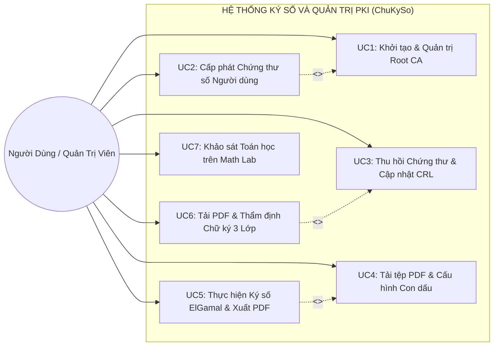

---

## 2.2. Phân tích và Lựa chọn Giải pháp Công nghệ

### 2.2.1. Lớp Thuật toán Mật mã học và Xử lý Số lớn

#### 2.2.1.1. So sánh lựa chọn kiểu dữ liệu và ngôn ngữ thực thi
Thuật toán chữ ký số ElGamal yêu cầu tính toán số học trên trường hữu hạn $\mathbb{Z}_p^*$ với các số nguyên tố lớn có kích thước 1024-bit hoặc 2048-bit (xấp xỉ 300 đến 600 chữ số thập phân). Trong môi trường Web, có ba giải pháp công nghệ chính:

| Tiêu chí Đánh giá | JavaScript Chuẩn (`Number`) | Thư viện Ngoài / WebAssembly (C++ GMP) | TypeScript Native `BigInt` (Được chọn) |
| :--- | :--- | :--- | :--- |
| **Độ dài bit hỗ trợ** | Giới hạn $2^{53} - 1$ (53-bit) | Tùy ý (Không giới hạn) | Tùy ý (Không giới hạn) |
| **Độ chính xác** | Mất mát độ chính xác số học | Chính xác $100\%$ | **Chính xác tuyệt đối $100\%$** |
| **Phụ thuộc gói ngoài** | Không | Cần nạp file `.wasm` lớn, khó debug | **Không phụ thuộc (Zero Dependencies)** |
| **Hỗ trợ kiểu tĩnh** | Không có | Phức tạp qua cầu nối FFI | **Hỗ trợ Type-Safe $100\%$ qua TypeScript** |
| **Tốc độ thực thi** | Nhanh nhưng không dùng được | Cực nhanh | **Tối ưu hóa cấp trình thông dịch V8** |

**Quyết định lựa chọn:** Hệ thống sử dụng **TypeScript Native `BigInt`** làm nền tảng tính toán số học số lớn. Kiểu `BigInt` được hỗ trợ nguyên bản trong tiêu chuẩn ECMAScript 2020+, cho phép thực hiện các phép toán modulo, lũy thừa nhanh (Square-and-Multiply) và giải thuật Euclid mở rộng với độ chính xác số học tuyệt đối mà không cần nạp thêm bất kỳ thư viện bên ngoài nào, đảm bảo mã nguồn nhẹ, bảo mật và dễ kiểm toán.

#### 2.2.1.2. Web Cryptography API (`crypto.subtle` & `crypto.getRandomValues`)
* **Tạo số ngẫu nhiên an toàn (Cryptographically Secure Pseudo-Random Number Generator - CSPRNG):** Sử dụng `crypto.getRandomValues()` để sinh khóa bí mật $x$ và tham số ngẫu nhiên dùng một lần $k$, đảm bảo độ hỗn loạn entropy cao từ phần cứng hệ điều hành, loại bỏ hoàn toàn nguy cơ đoán trước số $k$ [6].
* **Hàm băm phần cứng SHA-256:** Sử dụng `crypto.subtle.digest('SHA-256', buffer)` được chuẩn hóa bởi W3C [8], thực thi trực tiếp trên tập lệnh tăng tốc phần cứng của CPU, đạt tốc độ băm hàng trăm Megabytes mỗi giây.

---

### 2.2.2. Lớp Xử lý và Cấu trúc Nhị phân Tệp PDF (`pdf-lib`)

Tệp PDF (chuẩn ISO 32000-2:2020 [7]) có cấu trúc nhị phân dạng cây phức tạp gồm: Header, Body (các đối tượng Pages, Streams, Fonts), Cross-Reference Table (XRef) và Trailer Dictionary.

```
+--------------------------------------------------------------------+
|                CẤU TRÚC TÀI LIỆU PDF VÀ NHÚNG CHỮ KÝ SỐ            |
+--------------------------------------------------------------------+
| %PDF-1.7 (Header)                                                  |
| 1 0 obj << /Type /Catalog /Pages 2 0 R >> endobj                   |
| 2 0 obj << /Type /Pages /Kids [3 0 R] /Count 1 >> endobj           |
| 3 0 obj << /Type /Page ... >> endobj                               |
| 4 0 obj << /Length ... >> stream (Nội dung văn bản & Vector Seal)   |
| ...                                                                |
| 10 0 obj << /Type /Metadata /Subtype /XML >>                       |
|   stream (Chứa SignaturePackage JSON Base64 nhúng an toàn)         |
| endobj                                                             |
| xref ... (Bảng tra cứu tham chiếu chéo)                            |
| trailer << /Root 1 0 R /Info << /CustomSign ... >> >>              |
| %%EOF                                                              |
+--------------------------------------------------------------------+
```

Hệ thống sử dụng thư viện **`pdf-lib`** với các ưu điểm vượt trội:
* **Thuần TypeScript/JavaScript:** Hoạt động độc lập trong trình duyệt, không cần máy chủ backend hoặc engine Node.js.
* **Vẽ Vector Stamp độ nét cao:** Cho phép vẽ trực tiếp các đường tròn, ngôi sao 5 cánh, viền kép, văn bản uốn lượn và mã QR lên trang PDF với độ phân giải vector sắc nét, không bị nhòe vỡ khi phóng to.
* **Cơ chế nhúng Metadata an toàn:** Cho phép đính kèm gói chữ ký `SignaturePackage` trực tiếp vào tài liệu mà không làm thay đổi các khối nội dung hiển thị của các trang văn bản gốc.

---

### 2.2.3. Lớp Giao diện Người dùng và Quản lý Trạng thái

* **React 19 & Vite:** Cung cấp mô hình lập trình hướng thành phần (Component-Based), tối ưu hóa việc render DOM thông qua Virtual DOM và Vite HMR (Hot Module Replacement), giúp giao diện phản hồi mượt mà ở tần số 60 FPS.
* **Lucide React:** Cung cấp hệ thống biểu tượng chuẩn giao diện hiện đại, trực quan hóa trạng thái an ninh của các chứng thư và tài liệu.
* **Canvas API:** Được sử dụng trong thành phần ký tay (Digital Signature Pad), cho phép người dùng dùng chuột hoặc màn hình cảm ứng để vẽ chữ ký cá nhân trực tiếp.

---

## 2.3. Thiết kế Kiến trúc Tổng thể Hệ thống

### 2.3.1. Mô hình Kiến trúc Phân Lớp (Client-Side Zero-Knowledge)

Hệ thống được thiết kế theo mô hình kiến trúc phân lớp hướng dịch vụ cục bộ (**Local-First Service-Oriented Architecture**), bao gồm 4 tầng chức năng độc lập:

```
+-------------------------------------------------------------------------------+
|                       TẦNG TRÌNH DIỄN (PRESENTATION LAYER)                    |
|  - Tab PKI Management       - Tab PDF Signer         - Tab PDF Verifier       |
|  - Tab Math Lab Explorer    - Toast Notification     - Visual Seal Canvas     |
+---------------------------------------┬---------------------------------------+
                                        │
+---------------------------------------▼---------------------------------------+
|                        TẦNG DỊCH VỤ (SERVICE LAYER)                           |
|  - CertificateService: Quản lý cấp phát, lưu trữ, kiểm tra hiệu lực X.509     |
|  - PdfSigningService:  Băm SHA-256, nhúng SignaturePackage, đóng dấu PDF      |
|  - VerificationService: Thực thi quy trình thẩm định 3 lớp độc lập            |
+---------------------------------------┬---------------------------------------+
                                        │
+---------------------------------------▼---------------------------------------+
|                    TẦNG THUẬT TOÁN MẬT MÃ (CRYPTOGRAPHY LAYER)                |
|  - ElGamal Engine:     Tạo khóa {p,g,x,y}, Ký số {r,s}, Xác minh v1 ≡ v2      |
|  - BigInt Arithmetic:  Lũy thừa nhanh binaryPower, Euclid mở rộng modInverse  |
|  - Primes & Generators: Miller-Rabin 40 rounds, timPTSinh căn nguyên thủy    |
+---------------------------------------┬---------------------------------------+
                                        │
+---------------------------------------▼---------------------------------------+
|                 TẦNG NỀN TẢNG HỆ THỐNG (SYSTEM RUNTIME & STORAGE)             |
|  - Web Cryptography API (SHA-256, CSPRNG)      - LocalStorage (PKI Store)     |
|  - PDF-Lib Binary Parser Engine                - Browser Memory Sandbox       |
+-------------------------------------------------------------------------------+
```

---

### 2.3.2. Sơ đồ Khối Kiến trúc Thành phần (Component Block Diagram)

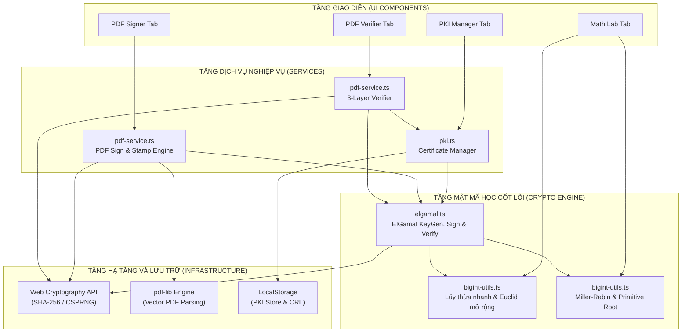

---

### 2.3.3. Sơ đồ Luồng Dữ liệu (Data Flow Diagram - DFD)

#### Sơ đồ DFD Mức 0 (Context Diagram):
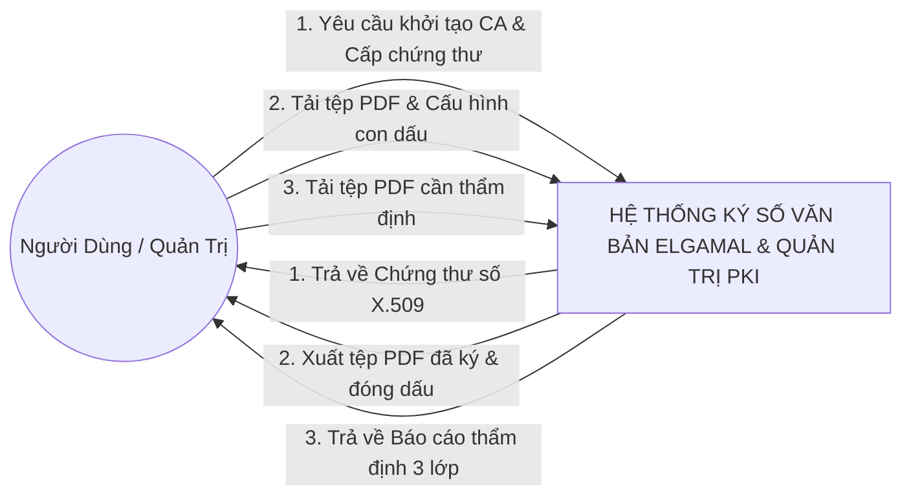

#### Sơ đồ DFD Mức 1 (Chi tiết các luồng xử lý):
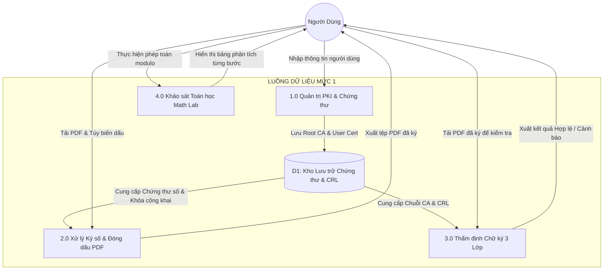

---

## 2.4. Thiết kế Chi tiết các Phân hệ Chức năng

### 2.4.1. Phân hệ Quản trị PKI và Vòng đời Chứng thư số

#### 2.4.1.1. Thiết kế quy trình cấp phát chứng thư số (Sequence Diagram)
Quy trình cấp phát chứng thư số người dùng mới tuân thủ nghiêm ngặt tiêu chuẩn **RFC 5280** [5]:

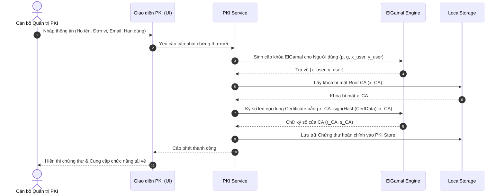

---

### 2.4.2. Phân hệ Ký số và Đóng dấu tài liệu PDF

#### 2.4.2.1. Thiết kế quy trình ký số và nhúng con dấu (Sequence Diagram)

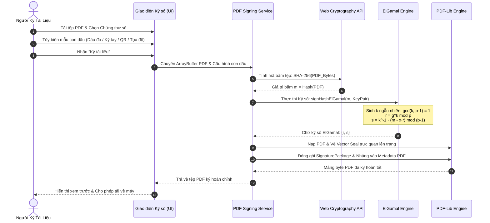

---

### 2.4.3. Phân hệ Thẩm định Chữ ký 3 Lớp (3-Layer Verification)

#### 2.4.3.1. Thiết kế giải thuật thẩm định phân tầng (Sequence Diagram)

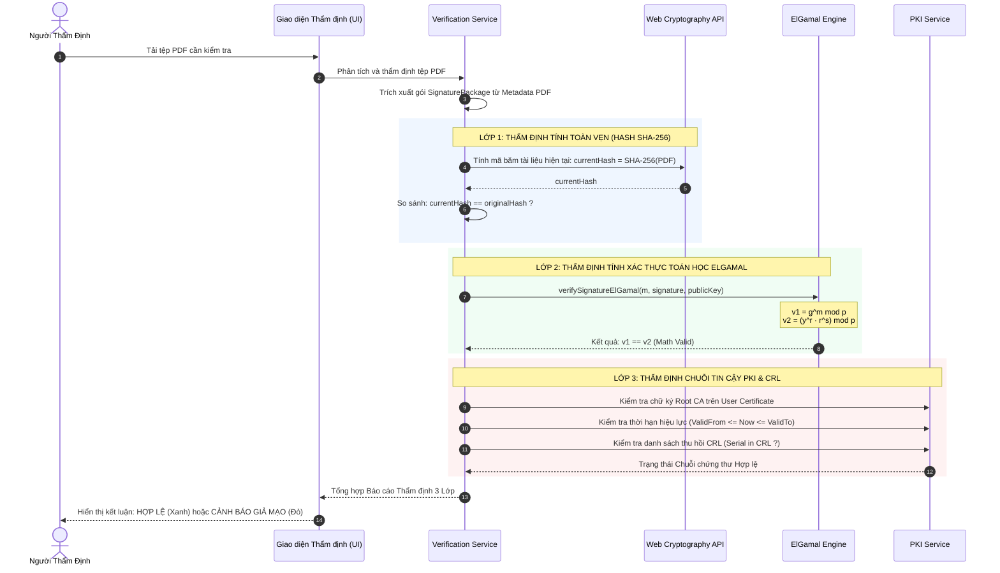

---

### 2.4.4. Phân hệ Phòng thí nghiệm Mật mã (Math Lab)

Phân hệ Math Lab được thiết kế để thực thi 4 mô-đun toán học rời rạc phục vụ nghiên cứu và kiểm thử:
1. **Mô-đun Lũy thừa nhanh Modulo ($a^b \bmod n$):** Triển khai thuật toán *Square-and-Multiply* nhị phân với độ phức tạp thời gian $\mathcal{O}(\log b)$ phép nhân số lớn.
2. **Mô-đun Giải thuật Euclid mở rộng ($k^{-1} \bmod m$):** Truy vết bảng số dư $(q, r, x, y)$ qua từng bước lặp, kiểm tra điều kiện khả nghịch $\gcd(k, m) = 1$.
3. **Mô-đun Kiểm tra số nguyên tố Miller-Rabin:** Chạy 40 vòng lặp xác suất với các cơ số ngẫu nhiên độc lập $a \in [2, n-2]$.
4. **Mô-đun Căn nguyên thủy (Primitive Root Generator):** Phân tích thừa số nguyên tố của $p - 1 = \prod q_i$, kiểm tra điều kiện $g^{(p-1)/q_i} \not\equiv 1 \pmod p$.

---

## 2.5. Thiết kế Mô hình Dữ liệu và Cấu trúc Đối tượng

### 2.5.1. Sơ đồ Lớp Tổng thể (Class Diagram)

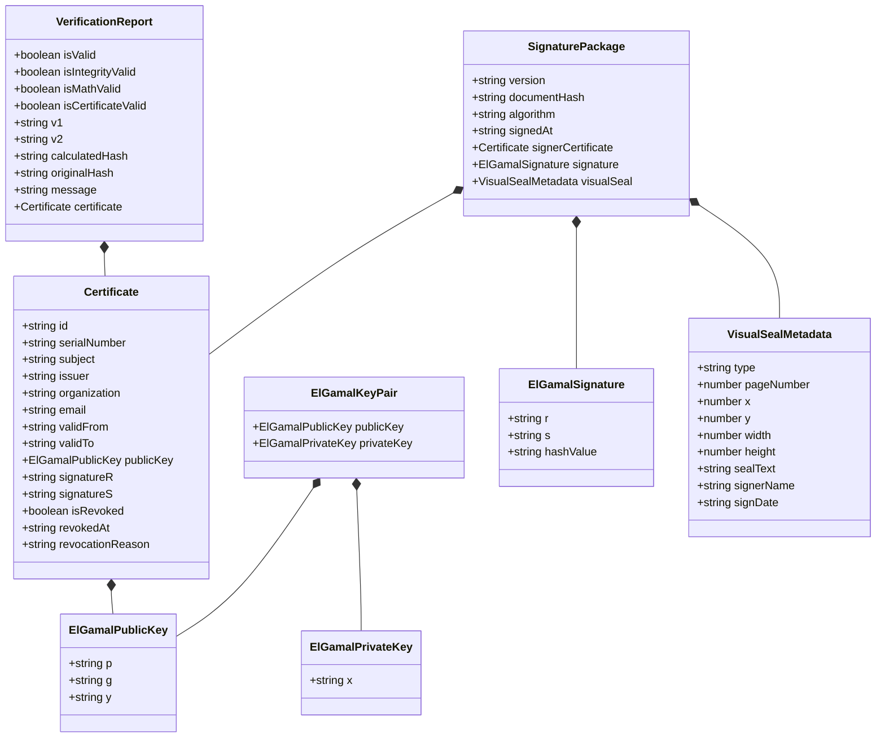

---

### 2.5.2. Cấu trúc Lưu trữ Metadata Gói Chữ Ký `SignaturePackage`

Gói dữ liệu `SignaturePackage` được mã hóa dưới dạng chuỗi JSON chuẩn và nhúng trực tiếp vào Metadata của tệp PDF:

```json
{
  "version": "1.0.0",
  "documentHash": "a3f5b8c2d1e4f7a9b0c3d2e1f4a5b6c7d8e9f0a1b2c3d4e5f6a7b8c9d0e1f2a3",
  "algorithm": "ElGamal-SHA256",
  "signedAt": "2026-08-20T14:30:00.000Z",
  "signature": {
    "r": "94827104928174928174019284019284019284019284019284",
    "s": "58291049281740192840192840192840192840192840192840",
    "hashValue": "74829104928174928174019284019284019284019284019284"
  },
  "signerCertificate": {
    "serialNumber": "CERT-2026-0820-001",
    "subject": "Nguyễn Văn A",
    "organization": "Đại Học Công Nghệ",
    "issuer": "ChuKySo Root CA",
    "validFrom": "2026-01-01T00:00:00.000Z",
    "validTo": "2027-01-01T00:00:00.000Z",
    "publicKey": {
      "p": "115792089237316195423570985008687907853269984665640564039457584007913129639935",
      "g": "2",
      "y": "84920194820194820194820194820194820194820194820194"
    }
  },
  "visualSeal": {
    "type": "official_red_stamp",
    "pageNumber": 1,
    "x": 420,
    "y": 150,
    "width": 140,
    "height": 140,
    "signerName": "Nguyễn Văn A"
  }
}
```

---

## 2.6. Thiết kế Giao diện và Trải nghiệm Người dùng

### 2.6.1. Bố cục Luồng Thao tác Người dùng (User Interaction Flow)

Hệ thống được tổ chức thành 4 phân hệ màn hình chính với thanh điều hướng Tab trực quan:
1. **Tab 1: Quản trị PKI (PKI Management):** Bảng điều khiển quản lý CA Gốc, form cấp phát chứng thư số người dùng mới và danh sách quản lý chứng thư/thu hồi CRL.
2. **Tab 2: Ký số PDF (PDF Signer):** Khu vực kéo thả tệp PDF, bảng chọn chứng thư số người ký, bảng công cụ thiết kế con dấu trực quan và nút bấm thực hiện ký số.
3. **Tab 3: Thẩm định Chữ ký (PDF Verifier):** Khu vực kéo thả tệp PDF cần kiểm tra, bảng phân tích kết quả 3 lớp trực quan với huy hiệu trạng thái HỢP LỆ hoặc CẢNH BÁO GIẢ MẠO.
4. **Tab 4: Phòng thí nghiệm Mật mã (Math Lab):** Bộ công cụ tính toán số học modulo tương tác trực tiếp với các trường nhập dữ liệu số lớn và bảng minh họa từng bước tính toán.

---

### 2.6.2. Minh họa Giao diện các Màn hình Chức năng

#### 1. Màn hình Quản trị PKI và Cấp phát Chứng thư số

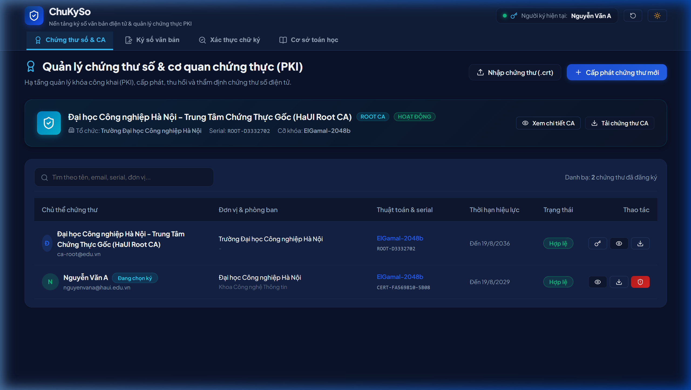
*Hình 2.1: Giao diện tổng quan quản trị PKI và danh sách chứng thư số*

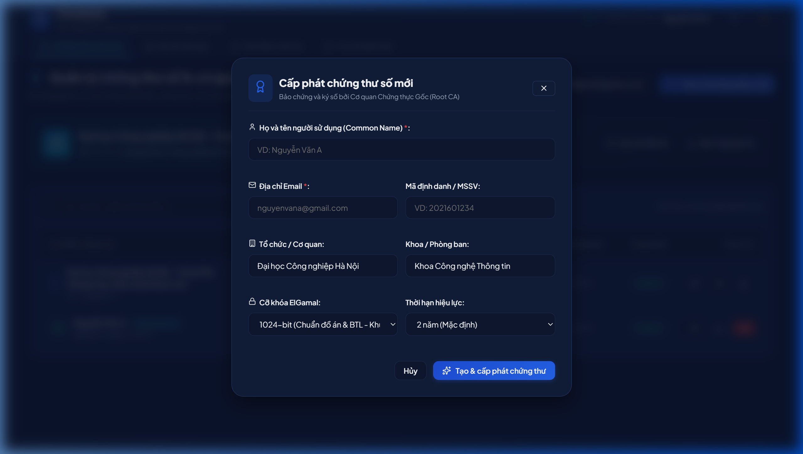
*Hình 2.2: Quy trình cấp phát chứng thư số người dùng mới từ Root CA*

#### 2. Màn hình Ký số và Tùy biến Con dấu điện tử trên PDF

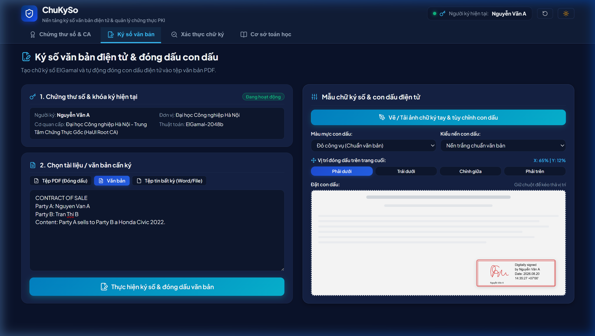
*Hình 2.3: Cấu hình ký số và tùy biến con dấu điện tử trên tài liệu PDF*

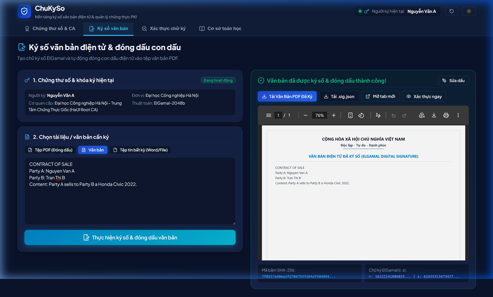
*Hình 2.4: Kết quả ký số thành công và đóng dấu trực quan lên tài liệu PDF*

#### 3. Màn hình Thẩm định Chữ ký 3 Lớp

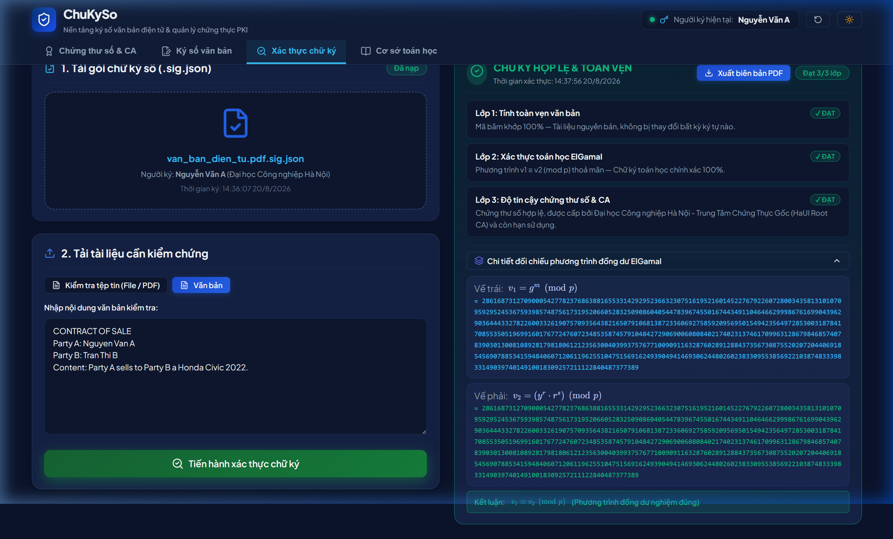
*Hình 2.5: Thẩm định chữ ký 3 lớp thành công - Chữ ký HỢP LỆ*

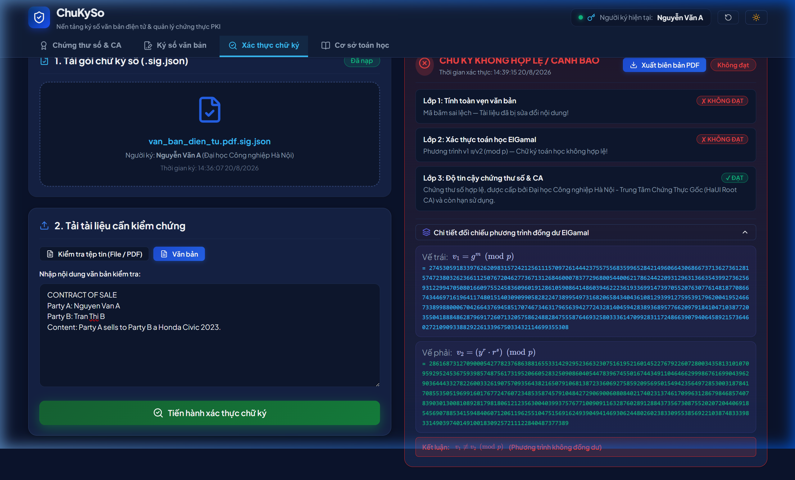
*Hình 2.6: Hệ thống phát hiện tài liệu bị can thiệp - Cảnh báo KHÔNG HỢP LỆ*

#### 4. Màn hình Phòng thí nghiệm Mật mã học (Math Lab)

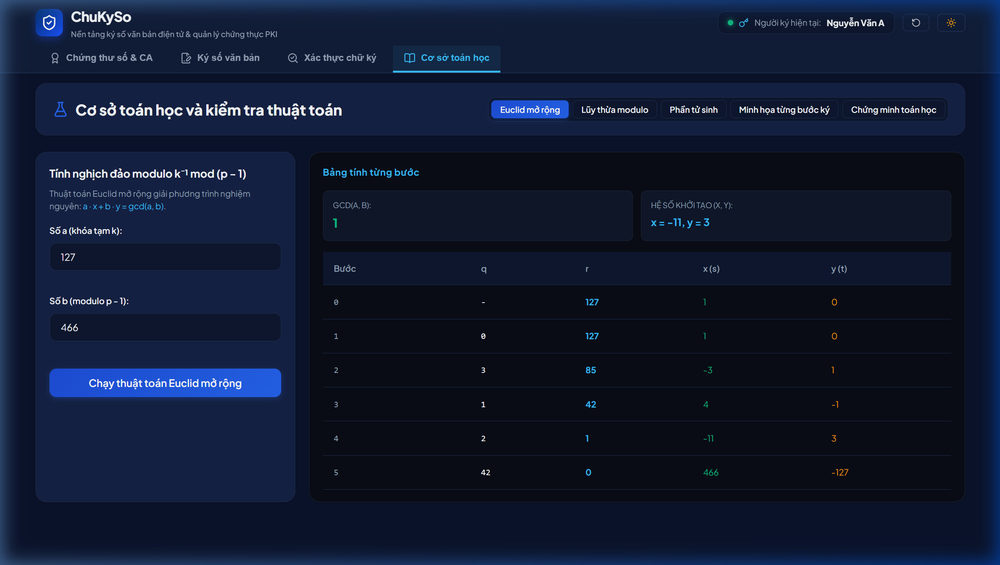
*Hình 2.7: Phòng thí nghiệm Mật mã học - Khảo sát số học Modulo & Miller-Rabin*

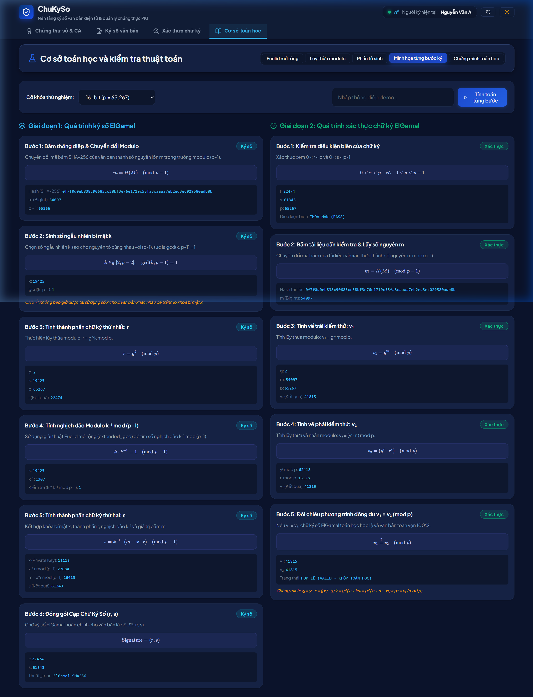
*Hình 2.8: Bảng phân tích chi tiết từng bước tính toán Euclid & Lũy thừa nhanh*

---

## TÀI LIỆU THAM KHẢO

[1] W. Diffie and M. E. Hellman, "New Directions in Cryptography," *IEEE Transactions on Information Theory*, vol. IT-22, no. 6, pp. 644–654, Nov. 1976. DOI: [10.1109/TIT.1976.1055638](https://doi.org/10.1109/TIT.1976.1055638).

[2] T. Elgamal, "A Public Key Cryptosystem and a Signature Scheme Based on Discrete Logarithms," *IEEE Transactions on Information Theory*, vol. IT-31, no. 4, pp. 469–472, July 1985. DOI: [10.1109/TIT.1985.1057074](https://doi.org/10.1109/TIT.1985.1057074).

[3] National Institute of Standards and Technology (NIST), "Digital Signature Standard (DSS)," *Federal Information Processing Standards Publication (FIPS PUB 186-5)*, U.S. Department of Commerce, Feb. 2023. DOI: [10.6028/NIST.FIPS.186-5](https://doi.org/10.6028/NIST.FIPS.186-5).

[4] National Institute of Standards and Technology (NIST), "Secure Hash Standard (SHS)," *Federal Information Processing Standards Publication (FIPS PUB 180-4)*, U.S. Department of Commerce, Aug. 2015. DOI: [10.6028/NIST.FIPS.180-4](https://doi.org/10.6028/NIST.FIPS.180-4).

[5] D. Cooper, S. Santesson, S. Farrell, S. Boeyen, R. Housley, and W. Polk, "Internet X.509 Public Key Infrastructure Certificate and Certificate Revocation List (CRL) Profile," *IETF RFC 5280*, May 2008. DOI: [10.17487/RFC5280](https://doi.org/10.17487/RFC5280).

[6] A. J. Menezes, P. C. van Oorschot, and S. A. Vanstone, *Handbook of Applied Cryptography*, CRC Press, Boca Raton, FL, USA, 1996. ISBN: 0-8493-8523-7.

[7] International Organization for Standardization, "Document management — Portable document format — Part 2: PDF 2.0," *ISO Standard 32000-2:2020*, Dec. 2020. [Online]. Available: https://www.iso.org/standard/75839.html

[8] World Wide Web Consortium (W3C), "Web Cryptography API," *W3C Recommendation*, Jan. 2017. [Online]. Available: https://www.w3.org/TR/WebCryptoAPI/

[9] Quốc hội nước Cộng hòa Xã hội Chủ nghĩa Việt Nam, "Luật Giao dịch điện tử số 20/2023/QH15," ban hành ngày 22 tháng 06 năm 2023, có hiệu lực từ ngày 01 tháng 07 năm 2024.

[10] Bộ Khoa học và Công nghệ, "TCVN 7635:2007: Công nghệ thông tin - Các kỹ thuật an toàn - Chữ ký số có phục hồi thông điệp," Tiêu chuẩn Quốc gia, Hà Nội, Việt Nam, 2007.
